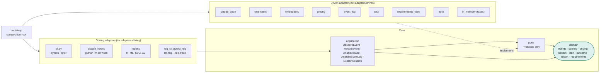

# Architecture guide

This guide explains how TER 4 is put together and how to work inside it. The
authoritative reference is [docs/ter4/architecture.md](../ter4/architecture.md)
and the decision records in [docs/decisions](../decisions/); this page links to
them rather than repeating them.

## Two packages, one distribution

| Package | What it is | Status |
|---|---|---|
| `src/ter_calculator/` | TER 3: the original calculator behind the `ter` command (`analyze`, `report`, `watch`, `context`, …) | Stable; wrapped and gradually replaced |
| `src/ter/` | TER 4: a hexagon of `domain`, `ports`, `application`, `adapters` and `bootstrap` | Where all new behaviour goes |

Both install from one `pyproject.toml`. Three console entry points exist:

```bash
ter --help                    # TER 3 CLI; `ter a3` and `ter explain` are handed to TER 4
python -m ter --help          # TER 4 CLI: observe, explain, a3, hook, capabilities
ter-req --help                # requirements tooling: lint, trace, points, report
```

## The hexagon



### The dependency rule

Dependencies point inward: **bootstrap → adapters → application → ports →
domain**. Concretely:

- `ter.domain` imports only the standard library and numpy. No TER 3, no
  vendor SDK, no IO module (`sqlite3`, `subprocess`, `socket`, `urllib`,
  `http`), no `yaml`, no `pytest`.
- `ter.ports` and `ter.application` know no vendors and no TER 3.
- None of the three imports an external capability's package or stack
  (`gare`, `pydantic`, `httpx`): outside systems are read by adapters at a
  file boundary ([ADR 0005](../decisions/0005-admitting-external-capabilities.md)).
- Driven adapters never import each other.
- TER 3 may use TER 4's domain, ports and adapters, but never
  `ter.application` or `ter.bootstrap` (one named exemption: the TER 3 CLI
  hands `ter a3` and `ter explain` to `ter.bootstrap.main`).
- The report renderers read only view-models (`SessionReport`, `A3Report`),
  never TER 3 types.
- No behaviour measure imports `ter.domain.outcome`: the outcome verdict is
  shown beside the measures, never read by them
  ([outcome.md](../ter4/outcome.md)).
- Repository evidence (`ter.domain.repository` and the engines in
  `ter.adapters.driven.repository`) imports no model SDK, tokenizer or
  embedder: what a repository says never depends on which model reads it
  ([l3-grounded.md](../ter4/l3-grounded.md)).

These are eight import-linter contracts in `[tool.importlinter]` in
`pyproject.toml`. `lint-imports` in CI and
`tests/architecture/test_import_contracts.py` both enforce them:

```bash
lint-imports
python -m pytest tests/architecture -q
```

When `lint-imports` fails it names the contract and the import chain. The fix
is almost always to move the code to the right layer or to add a port, not to
add an exemption.

### Ports

| Port | Kind | Real adapters | Fake | Contract suite |
|---|---|---|---|---|
| `SessionSource` | driven | `ClaudeCodeJsonlSource` | `InMemorySessionSource` | `tests/contract/test_session_source.py` |
| `Tokenizer` | driven | `RegexTokenizer` (offline, deterministic), `TiktokenTokenizer` | the regex one doubles as the fake | covered by golden and unit tests |
| `Embedder` | driven | `HashingEmbedder` (offline, deterministic) | same | covered by golden tests |
| `Clock` | driven | `SystemClock` | `FixedClock` | unit tests |
| `PriceBook` | driven | `JsonPriceBook` (reads `src/ter/data/price_book.json`) | `InMemoryPriceBook` | `tests/contract/test_price_book.py` |
| `EventLog` | driven | `JsonlEventLog` | `InMemoryEventLog` | `tests/contract/test_event_log.py` |
| `TerScorer` | driven | `Ter3Scorer` (wraps TER 3) | `FixedTerScorer` | `tests/contract/test_ter_scorer.py` |
| `OutcomeSource` | driven | `JUnitOutcomeSource` (JUnit XML test results, [outcome.md](../ter4/outcome.md)) | `InMemoryOutcomeSource` | `tests/contract/test_outcome_source.py` |
| `RepositoryEvidence` | driven | `LexicalRepositoryEvidence`, `GitRepositoryEvidence`, `PythonSyntaxEvidence` ([l3-grounded.md](../ter4/l3-grounded.md)) | `InMemoryRepositoryEvidence` | `tests/contract/test_repository_evidence.py` |
| `EventIngest` | driving | `ObserveEvent` (long-lived process), `RecordEvent` (append-only, one hook process) | n/a | `tests/contract/test_event_ingest.py` |

Ports are `typing.Protocol` classes in `src/ter/ports/driven.py` and
`src/ter/ports/driving.py`, and each docstring lists the obligations its
contract suite checks.

### Capabilities: adapters by port and name

Every driven adapter is a **capability** named `<Port>.<adapter>`
(`Tokenizer.regex`, `SessionSource.claude-code`). The registry in
`ter.bootstrap.capabilities` holds TER's own adapters as built-ins and adds
whatever installed packages declare in the `ter.capabilities` entry-point
group (TER's `pyproject.toml` declares its built-ins there too):

```toml
[project.entry-points."ter.capabilities"]
"Tokenizer.words" = "my_pack.tokenizer:WordTokenizer"
```

The registry resolves a built-in without scanning installed packages (hooks
stay cheap) and imports a capability's module only when a use case first asks
for it (TER-ARC-006). It rejects a class or instance that does not satisfy
its port's Protocol, naming the missing members, and it never raises out of
discovery: a capability that fails to load, names an unknown port or tries to
replace a built-in is reported and every other capability keeps working
(TER-ARC-004, TER-ARC-005). To see what is installed and what is broken
(exit status 1 when anything is):

```bash
python -m ter capabilities
```

## Strangler fig over TER 3

TER 4 does not rewrite TER 3 in one go ([ADR 0001](../decisions/0001-hexagonal-strangler-rebuild.md)).
Capabilities move into the hexagon one at a time, and each move:

1. ships on its own and keeps `ter analyze` working;
2. leaves the golden snapshots unchanged, or changes them in a deliberate,
   reviewed diff ([ADR 0002](../decisions/0002-hermetic-golden-characterisation.md));
3. leaves the TER 3 import path as a shim that delegates inward.

Moves so far: TER scoring arithmetic (`ter_calculator.compute` delegates to
`ter.domain.scoring`), cost arithmetic (`ter.domain.pricing`) and model prices
(read through the `PriceBook` port from dated data,
[ADR 0003](../decisions/0003-price-book-as-data.md)). The L2 Lean model is
new code with no TER 3 predecessor ([ADR 0004](../decisions/0004-lean-waste-model.md)).
The current table is in [docs/ter4/architecture.md](../ter4/architecture.md#strangler-moves-so-far).

Work from other projects enters the same way, as **capability packs**: a
port, its contract suite, EARS requirements, a fake and one reference adapter
that reads the outside system's files by schema name, with no code vendored
and no package imported ([ADR 0005](../decisions/0005-admitting-external-capabilities.md);
how to add one is in the
[contributing guide](contributing.md#adding-a-capability-pack)).

Two rules follow from the strangler approach:

- **Never hard-code a model price.** Add a dated entry with a `source` note
  to `src/ter/data/price_book.json`.
- **Scoring changes show up as a golden diff.** Regenerate with
  `TER_UPDATE_GOLDEN=1` and commit the diff on purpose (see the
  [testing guide](testing.md#golden-snapshots)).

## The event contract

Every harness adapter translates its native records into one neutral stream,
`ter.event/0.5`: `intent.stated`, `reasoning`, `response`, `tool.requested`
and `tool.completed`, plus lifecycle kinds that are never scored
(`task.completed` and `subagent.completed` from hooks, and the routing kinds
`route.selected`, `route.failover`, `attempt.started`,
`verification.completed` and `outcome.recorded` from GARE, and
`context.supplied` when TER hands the agent a context bundle), each with a stable id, provenance and a tool *kind*
(`fs.read`, `fs.edit`, `exec.shell`, …) rather than a native tool name.
Detectors reason about kinds, so a second harness needs a new
`SessionSource` adapter and nothing else. See
[the event contract](../ter4/architecture.md#the-event-contract-terevent05).

## Adding an adapter

Worked example: a second session format.

1. **Implement the port** in a new package under
   `src/ter/adapters/driven/<name>/`. It may import anything inward and its
   vendor library; it must not import another driven adapter.

   ```python
   from pathlib import Path

   from ter.domain import SessionTrace


   class MyHarnessSource:
       format_name = "my-harness/1"

       def read(self, ref: str | Path) -> SessionTrace:
           ...  # map native records to ter.event events; count what you cannot map
   ```

2. **Add it to the `independent-adapters` contract** in `pyproject.toml`
   so it stays independent of the other driven adapters.
3. **Run the port's contract suite against it** by adding a factory to the
   fixture's `params` in `tests/contract/test_session_source.py`. The real
   adapter and the fake must both pass the same assertions.
4. **Wire it in the composition root** (`src/ter/bootstrap/__init__.py`).
   Only bootstrap chooses concrete adapters; import heavy adapters lazily
   inside the factory function, as `cli_services()` does, so hooks stay
   light.
5. **Type it strictly.** `mypy src/` applies `disallow_untyped_defs` and the
   other strict flags to every `ter.*` module.
6. **Record the behaviour** as an EARS requirement and tag its tests (see
   the [EARS guide](ears.md)).

## Maturity levels

`ter.domain.Maturity` models seven levels. A level is two things at once:

- a **build gate**: TER claims a level only when every requirement at that
  level is verified by a passing test (`ter-req trace --gate LN`);
- a **runtime ceiling**: `Maturity.permits(required)` answers whether a
  capability needing level `required` may run under an installation's
  ceiling, and the composition root is the place that applies it. Nothing
  above L2 exists yet; today's hook adapter is observe-only and always
  answers Claude Code with `{}` (TER-OBS-008), so observation cannot steer
  the agent.

| Level | Name | What it adds | What its gate means |
|---|---|---|---|
| L0 | Measured | TER 3 parity inside the hexagon: event contract, scoring, pricing | Golden TER 3 scores unchanged, user tokens never scored, dependencies point inward |
| L1 | Observed | The event stream as the core boundary; Claude Code hooks; live analysis equals batch | Hook append within 50 ms p95, redelivery changes nothing, incremental = batch |
| L2 | Explained | Lean model, sixteen waste detectors, evidence graph, scorecard, A3 | Every finding cites events; iteration is not rework; A3 derives countermeasures from findings |
| L3 | Grounded | Repository evidence: AST, symbols, tests, git diff, change surface | Not started beyond the session-level evidence graph |
| L4 | Advisory | Intervention engine, declarative policies, an intervention ledger | Not started |
| L5 | Corrective | Routing and opt-in corrective actions; calibration on real data | Not started |
| L6 | Learning | Closed loop, a second harness, research datasets | Not started |

Current state (from `ter-req report` and [points.md](../ter4/points.md)):

| Level | Requirements verified | Vision points done / partial / not started | CI gate |
|---|---|---|---|
| L0 Measured | 23 of 24 | 10 / 1 / 0 | `ter-req trace --gate L0` |
| L1 Observed | 4 of 12 | 10 / 6 / 0 | `ter-req trace --gate L1` |
| L2 Explained | 33 of 55 | 26 / 23 / 5 | `ter-req trace --gate L2` |
| L3 Grounded | 2 of 20 | 3 / 8 / 37 | none yet |
| L4 Advisory | 0 of 15 | 0 / 4 / 35 | none yet |
| L5 Corrective | 0 of 9 | 1 / 3 / 9 | none yet |
| L6 Learning | 0 of 9 | 0 / 2 / 17 | none yet |

A gate checks only requirements already `verified` at or below its level;
`planned` ones document the road ahead without failing CI. So "the L1 gate
passes" means every verified L1 requirement has a passing test, not that all
of L1 is built: the Stop and SubagentStop hooks, for example, wait on real
data in issue #35. Get live numbers with:

```bash
python -m pytest --req-trace=req-trace.json
ter-req report --results req-trace.json
```

## Where to go next

- [docs/ter4/architecture.md](../ter4/architecture.md): contracts, strangler
  table, gate tables per level.
- [docs/ter4/l1-observed.md](../ter4/l1-observed.md) and
  [docs/ter4/l2-explained.md](../ter4/l2-explained.md): what each level built.
- [Testing guide](testing.md): how the gates are tested.
- [Contributing guide](contributing.md): the checklist for a change.
