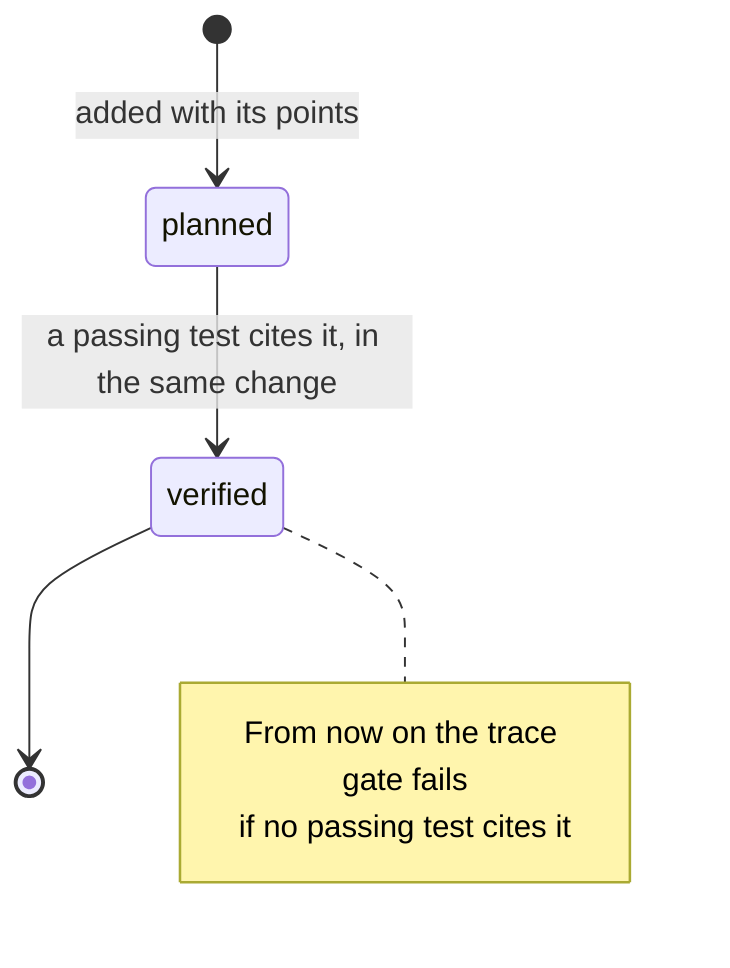
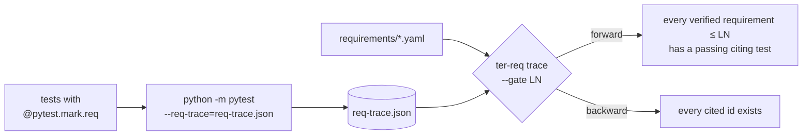

# Writing EARS requirements

Every TER 4 behaviour is written down as a requirement in EARS (the Easy
Approach to Requirements Syntax), kept in YAML under `requirements/`, cited by
the tests that verify it, and gated in CI. This guide teaches the grammar,
shows how the catalogue is laid out, and walks a requirement from idea to
`verified`. The reference is [docs/ter4/requirements.md](../ter4/requirements.md).

## Why EARS

Free prose requirements drift: "the hook should be fast" cannot be tested and
means something different to each reader. EARS constrains every requirement to
one of six sentence templates. Each has exactly one system and one `shall`, so
each can be tested, compared and linted by a machine.

## The six patterns

| Pattern | Template | Use it for |
|---|---|---|
| Ubiquitous | The `<system>` shall `<response>`. | Always true, no trigger |
| Event-driven | When `<trigger>`, the `<system>` shall `<response>`. | A response to something happening |
| State-driven | While `<state>`, the `<system>` shall `<response>`. | Behaviour that holds during a state |
| Unwanted | If `<condition>`, then the `<system>` shall `<response>`. | Errors, faults, bad input |
| Optional | Where `<feature>`, the `<system>` shall `<response>`. | Behaviour that exists only with a feature or configuration |
| Complex | Two or more clauses in the order Where, While, When or If | Combinations of the above |

Real examples from the catalogue:

- **Ubiquitous** (TER-ARC-001): *The TER codebase shall keep every package
  dependency pointing inward, from bootstrap to adapters to application to
  ports to domain.*
- **Event-driven** (TER-OBS-003): *When a PostToolUse hook event is received,
  the hook adapter shall append a normalised `tool.completed` event within
  50 ms at the 95th percentile.*
- **State-driven** (TER-OBS-008): *While the maturity ceiling is L1 Observed,
  the hook adapter shall return an empty hook response to Claude Code.*
- **Unwanted** (TER-REQ-003): *If a test cites a requirement id that is absent
  from the catalogue, then the traceability gate shall fail and name the
  citing test.*
- **Optional** (TER-SCR-002): *Where the scorecard shows an aggregate
  indicator, TER shall show the weight and value of every dimension that forms
  it.*
- **Complex**: *Where corrective interventions are enabled, while a session is
  active, when the same failure repeats after a fix, the intervention engine
  shall …* (clauses in Where, While, When/If order, each followed by a comma).

## The catalogue

`requirements/` holds one YAML file per maturity level, plus the vision points
and an optional vocabulary:

```text
requirements/
├── l0_measured.yaml     level: L0
├── l1_observed.yaml     level: L1
├── l2_explained.yaml    level: L2
├── l3_grounded.yaml … l6_learning.yaml
├── points.yaml          the 200 vision points
└── vocabulary.yaml      discouraged term → preferred term
```

An entry:

```yaml
level: L1
requirements:
  - id: TER-OBS-008              # TER-<AREA>-NNN, unique across the catalogue
    pattern: state-driven        # must match what the text reads as
    text: >-
      While the maturity ceiling is L1 Observed, the hook adapter shall
      return an empty hook response to Claude Code.
    level: L1                    # must equal the file's level
    source_points: [122]         # vision points it enforces (1 to 200)
    rationale: >-
      Passive observation is the safe default; an observe-only hook cannot
      change agent behaviour.
    status: verified             # planned | verified
```

Optional fields: `port` (the port the behaviour belongs to). Unknown fields
are rejected. Areas in use: `ANL` analysis, `SRC` session sources, `OBS`
observation, `LEN` Lean model, `DET` waste detectors, `WIP`, `ITN` intent,
`SCR` scorecard, `RPT` reports, `FLW` flow, `EVD` repository evidence, `GRF`
evidence graph, `CTX` context bundles, `RTE` routing, `INT` interventions,
`CAL` calibration, `BEN` benchmarks, `RSH` research protocols, `EXP`
explanation, `ARC` architecture, `REQ` the requirements and documentation
controls themselves.

### Status: planned → verified



- **planned**: written, linted, linked to its points; documents the road
  ahead. It never fails the trace gate, even with no tests.
- **verified**: at least one passing test carries
  `@pytest.mark.req("<id>")`. Set it in the same change that adds that test.

Do not mark a requirement verified on a test that proves only part of it.
Leave it planned and name the partial test in the point's `verification`
instead (see [definition-of-done.md](definition-of-done.md)); the L2 catalogue
does this for TER-DET-004, 007 and 008, among others.

## Writing a good requirement

1. **One behaviour, one `shall`.** Split "shall record and report" into two
   requirements if they can fail independently.
2. **Name the system precisely and briefly.** "the hook adapter", "the
   traceability gate", "TER". The lint rejects a system name over six words:
   usually a missing comma after a clause.
3. **Make it measurable.** Replace "quickly" with "within 50 ms at the 95th
   percentile"; replace "robust" with the fault and the response.
4. **Say what, not how.** "shall discard the duplicate without changing stored
   state", not "shall check a hash set".
5. **Pick the pattern from the trigger.** A response to an event is
   event-driven; to a fault it is unwanted; to a mode or feature it is
   state-driven or optional.
6. **Use the controlled vocabulary.** `vocabulary.yaml` maps `transcript` to
   `session`, `LLM` to `language model` and `nudge` to `intervention`.

Before and after:

| Weak | EARS |
|---|---|
| The hook should be fast. | When a PostToolUse hook event is received, the hook adapter shall append a normalised `tool.completed` event within 50 ms at the 95th percentile. |
| Duplicates must not break things. | If an event arrives with an identity already recorded, then TER shall discard it without changing analysis state. |
| Reports and/or charts should be accessible. | The report renderer shall give every chart a title and a description linked through `aria-labelledby`. |

## What the lint checks

```bash
ter-req lint                         # catalogue and points
ter-req lint --tests tests           # also: every req marker cites a known id
ter-req lint --strict --tests tests  # also fail on warnings
```

| Code | Rule |
|---|---|
| `EARS-SHALL` | exactly one `shall` |
| `EARS-END`, `EARS-CASE` | ends with a full stop; starts with a capital |
| `EARS-RESPONSE` | something follows `shall` |
| `EARS-CLAUSE` | each clause starts with Where, While, When or If, is not empty, and is followed by a comma |
| `EARS-THEN` | `then` after an If clause, and nowhere else |
| `EARS-ORDER` | each keyword once, in Where, While, When/If order; not both When and If |
| `EARS-SUBJECT` | a system is named before `shall`, in at most six words |
| `EARS-PATTERN` | the declared `pattern` matches the pattern the text reads as |
| `EARS-VAGUE` | none of: should, may, might, could, must, fast, quickly, slow, appropriate(ly), efficient(ly), user-friendly, easy, easily, adequate, sufficient, robust, seamless(ly), optimal, etc, and/or, TBD |
| `EARS-VOCAB` | discouraged terms from `vocabulary.yaml` |
| `CAT-DUPLICATE` | ids are unique |
| `REQ-ORPHAN` | every requirement names at least one vision point |
| `POINT-*` | the point checks described in [definition-of-done.md](definition-of-done.md#what-the-lint-enforces) |

Two broken requirements and what the lint says:

```yaml
  - id: TER-OBS-901
    pattern: event-driven
    text: When a hook fires TER should quickly record the event
  - id: TER-OBS-902
    pattern: unwanted
    text: If the log is missing, TER shall create it.
```

```text
requirements/l1_observed.yaml: TER-OBS-901: [EARS-END] text must end with a full stop
requirements/l1_observed.yaml: TER-OBS-901: [EARS-SHALL] text must contain exactly one 'shall' (found 0)
requirements/l1_observed.yaml: TER-OBS-901: [EARS-VAGUE] banned word 'should'
requirements/l1_observed.yaml: TER-OBS-901: [EARS-VAGUE] banned word 'quickly'
requirements/l1_observed.yaml: TER-OBS-902: [EARS-THEN] an If clause needs 'then' before the system
```

Fixed: *When a hook event is received, TER shall append the event to the
event log within 50 ms at the 95th percentile.* and *If the event log
directory is missing, then the event log shall create it before the first
append.*

## Tagging tests

A test says which requirement it verifies with the `req` marker. One marker
can cite several ids, and a class-level marker applies to every method:

```python
import pytest


@pytest.mark.req("TER-OBS-004")
def test_redelivery_changes_nothing(ingest) -> None:
    ...


@pytest.mark.req("TER-ANL-010", "TER-OBS-004")
@pytest.mark.parametrize("name", sorted(CORPUS))
def test_live_with_redelivery_through_the_log_equals_batch(name: str) -> None:
    ...


@pytest.mark.req("TER-DET-006")
class TestReworkCycle:
    def test_identical_failure_after_fix_is_rework(self) -> None: ...
```

Cite a requirement only from a test that proves it. A test that exercises the
code but would still pass if the behaviour broke is not verification.

## Trace and gates



```bash
python -m pytest --req-trace=req-trace.json
ter-req trace --results req-trace.json --gate L0
ter-req trace --results req-trace.json --gate L2 --summary summary.md
```

The trace file maps each id to the tests that cite it and their outcomes
(`passed`, `failed`, `skipped`, `xfailed`, `xpassed`, or `not-run` when
deselected). The gate fails when:

- **forward**: a `verified` requirement at or below the gate level has no
  *passing* citing test (a skipped or deselected test does not count);
- **backward**: a test cites an id that is not in the catalogue.

It also lists planned requirements that already have a passing test, ready to
promote. CI runs the gate at L0, L1 and L2 on Python 3.11 and appends the L0
report to the job summary.

## Coverage report

```bash
ter-req report --results req-trace.json
ter-req report --results req-trace.json --out coverage.md
ter-req report --results req-trace.json --gate L2
```

```text
| Level | Coverage | Traced | Verified | Planned |
|---|---|---:|---:|---:|
| L0 Measured (gate) | `███████████████████░` 96% | 23/24 | 23 | 1 |
| L1 Observed | `███████░░░░░░░░░░░░░` 33% | 4/12 | 4 | 8 |
| L2 Explained | `█████████░░░░░░░░░░░` 46% | 19/41 | 19 | 22 |
```

`█` is verified and traced, `▓` verified with no passing test (a gate
failure waiting to happen), `░` planned. A Mermaid pie of the status split,
the vision-point grid and a table of every requirement per level follow.
Without `--results` the report shows the catalogue alone.

## Worked example: adding a requirement

1. Find the point(s) it enforces in [points.md](../ter4/points.md).
2. Add the entry to the file for its level with `status: planned` and
   `source_points`, and add its id to each point's `rules` in
   `requirements/points.yaml`. Links must go both ways.
3. Lint and regenerate the points index:

   ```bash
   ter-req lint --tests tests
   ter-req points
   ```

4. Write the test with `@pytest.mark.req("<id>")` and make it pass.
5. Set `status: verified`, update the point's `status` and `verification`,
   run `ter-req points` again, and run the gate:

   ```bash
   python -m pytest --req-trace=req-trace.json
   ter-req trace --results req-trace.json --gate L2
   ```

6. Name the requirement and point ids in the commit message and PR body.
