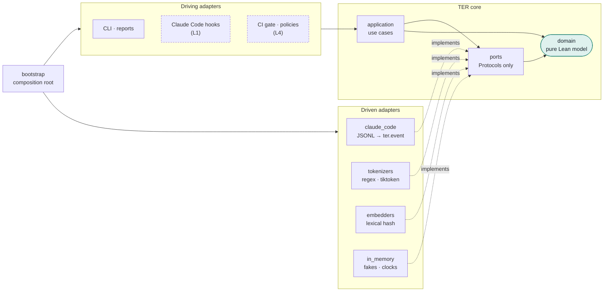
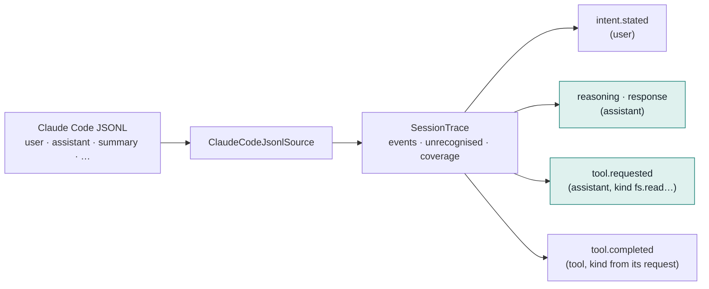
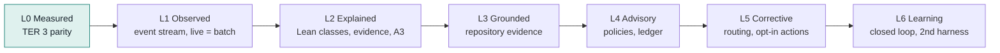

# TER 4 architecture

TER 4 turns TER from a token efficiency calculator into a Lean analysis
platform for agentic software engineering. It is built as a hexagon of ports
and adapters, delivered through maturity levels L0 to L6, and rebuilt from
TER 3 by strangler fig: each step ships, keeps `ter analyze` working, and is
protected by the golden tests of every level below it.

The full design is the TER 4 Blueprint. This page covers what is in the
repository today and the rules the code must follow.

## The hexagon

| Package | Holds | May import |
|---|---|---|
| `ter.domain` | Event model, maturity levels; later the Lean model, detectors, evidence graph, scorecard | stdlib, numpy |
| `ter.ports` | `SessionSource`, `Tokenizer`, `Embedder`, `Clock` | `ter.domain` |
| `ter.application` | Use cases (empty at L0) | ports, domain |
| `ter.adapters` | Everything that knows a vendor, format or IO | anything inward, plus `ter_calculator` |
| `ter.bootstrap` | Wiring, and the maturity ceiling | everything |

The rules are enforced, not described. `[tool.importlinter]` in
`pyproject.toml` declares four contracts, and both the `lint-imports` CI step
and `tests/architecture` fail when one breaks:

1. **hexagon-layers**: bootstrap → adapters → application → ports → domain, never outward.
2. **pure-domain**: the domain imports no TER 3 internals, no vendor SDKs, no IO modules.
3. **vendor-free-core**: ports and use cases import no TER 3 internals or vendor SDKs.
4. **independent-adapters**: driven adapters never import each other.

## The event contract (`ter.event/0.1`)

Every harness adapter translates its native records into one neutral stream.
Detectors reason about tool *kinds*, so supporting another agent means a new
adapter and no change to analysis.

Shaded events are generated by the agent and are the only ones TER scores.
Each event has a stable id derived from its source record, full provenance
(file, record, lines, block, fingerprint), and usage attached once per model
turn. Records the adapter cannot map are counted by type, so every trace
reports its coverage.

## Maturity levels

`ter.domain.Maturity` models the levels. A level is both a build gate (every
requirement at that level verified) and a runtime ceiling
(`Maturity.permits`).

### L0 gate, as built

| Check | Where | Requirement |
|---|---|---|
| TER 3 scores unchanged on the golden corpus | `tests/golden/test_ter3_characterisation.py` | TER-ANL-000 |
| User-authored tokens never scored | same, and `tests/contract` | TER-ANL-001 |
| aligned + waste = total, 0 ≤ TER ≤ 1 | same | TER-ANL-002 |
| Unmapped records counted | `tests/unit/test_ter4_*` | TER-SRC-002 |
| Same JSONL, same event stream | `tests/golden/test_event_stream_snapshot.py`, `tests/contract` | TER-SRC-004 |
| Dependencies point inward | `tests/architecture`, `lint-imports` | TER-ARC-001 |

Tests carry `@pytest.mark.req("<id>")`. The EARS requirement catalogue and
the CI traceability gate that checks these links arrive in the next step.
