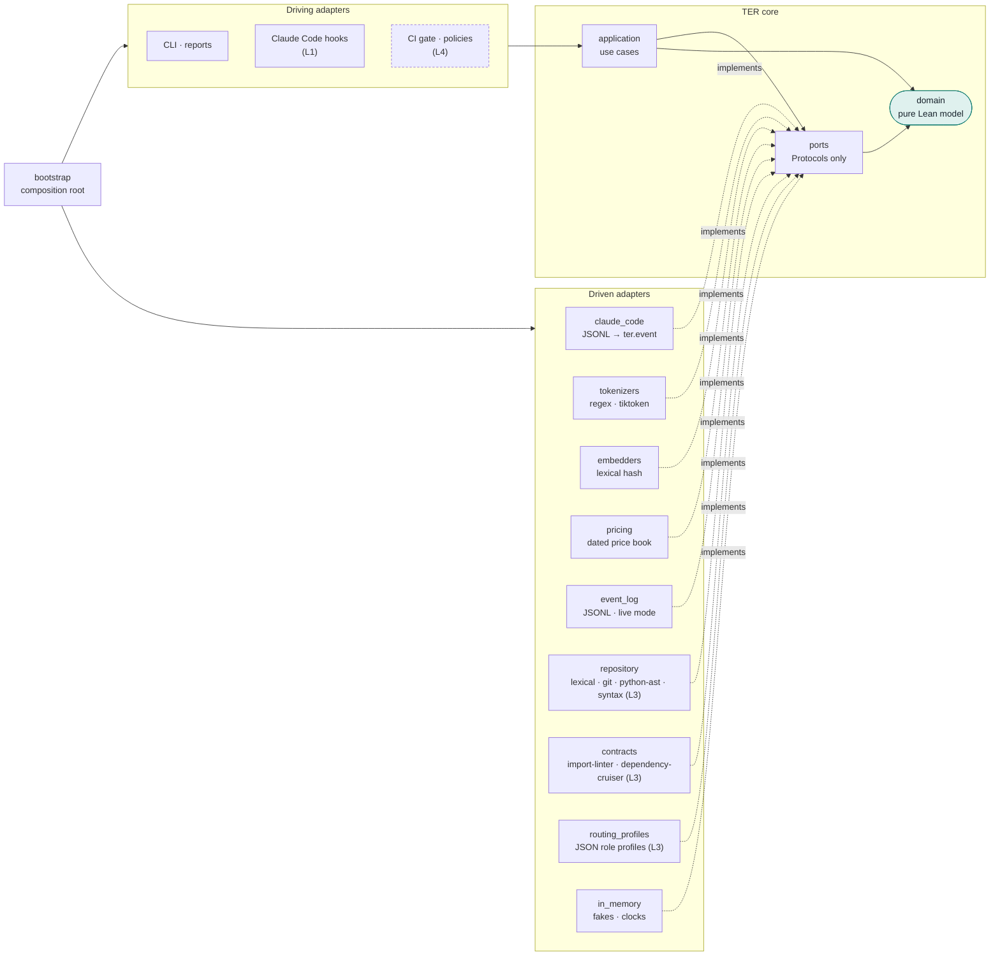
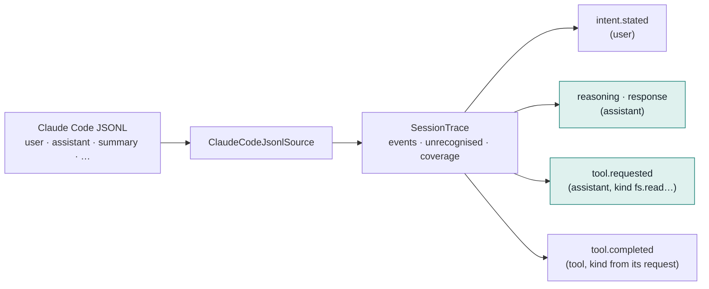
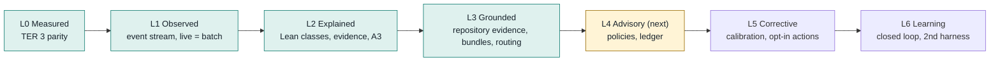

# TER 4 architecture

TER 4 turns TER from a token efficiency calculator into a Lean analysis
platform for agentic software engineering. It is built as a hexagon of ports
and adapters, delivered through maturity levels L0 to L6, and rebuilt from
TER 3 by strangler fig: each step ships, keeps `ter analyze` working, and is
protected by the golden tests of every level below it.

The full design is the TER 4 Blueprint. This page covers what is in the
repository today and the rules the code must follow. L0 to L3 are met; where
TER goes next (L4 Advisory to L6 Learning) is in
[strategy.md](strategy.md).

## The hexagon

| Package | Holds | May import |
|---|---|---|
| `ter.domain` | Event model, maturity levels, TER scoring (`scoring`: phase scores, weighted aggregate, raw ratio, aligned/waste accounting), pricing (`pricing`: `Rates`, dated `PriceSchedule`, cost arithmetic), the incremental `AnalysisEngine` (L1), the `SessionReport` view-model (`report`), the Lean model, detectors, evidence graph, scorecard and A3 view-model (`ter.domain.lean`, L2), outcome and acceptance verdicts (`outcome`, see [outcome.md](outcome.md)), capability value types (`capabilities`), repository evidence values and rules (`repository`), change surface and grounded detectors (`lean.surface`, `lean.grounding`), context bundles and their measures (`context_bundle`, `context_metrics`), routing (`routing`), session languages and stack (`stack`, `stack_comparison`) (L3) | stdlib, numpy |
| `ter.ports` | Driven: `SessionSource`, `Tokenizer`, `Embedder`, `Clock`, `PriceBook`, `EventLog`, `TerScorer`, `OutcomeSource`, `RepositoryEvidence`, `ArchitectureContracts`, `RoutingProfiles`. Driving: `EventIngest` | `ter.domain` |
| `ter.application` | Use cases: `ObserveEvent`, `RecordEvent`, `AnalyseTrace`, `AnalyseEventLog` (L1), `ExplainSession` (L2; grounded with `repository=` and `contracts=` at L3), `ground_session`, `ContextBuilder`, `SupplyContext`, `MeasureContext`, `RouteSession`, `read_stack`, `CompareByStack` (L3) | ports, domain |
| `ter.adapters` | Everything that knows a vendor, format or IO | anything inward, plus `ter_calculator` |
| `ter.bootstrap` | Wiring, the capability registry (`ter.capabilities` entry points, ADR 0005) and the maturity ceiling | everything |

The rules are enforced, not described. `[tool.importlinter]` in
`pyproject.toml` declares eight contracts, and both the `lint-imports` CI step
and `tests/architecture` fail when one breaks:

1. **hexagon-layers**: bootstrap → adapters → application → ports → domain, never outward.
2. **pure-domain**: the domain imports no TER 3 internals, no vendor SDKs, no IO modules, and no external capability package or stack (`gare`, `pydantic`, `httpx`; ADR 0005).
3. **vendor-free-core**: ports and use cases import no TER 3 internals, vendor SDKs or external capability packages (ADR 0005).
4. **independent-adapters**: driven adapters never import each other (chains
   through TER 3 to the pricing adapter are exempt: TER 3 is outside the hexagon).
5. **ter3-uses-hexagon-edges**: TER 3 uses TER 4 only through the domain, ports
   or adapters, never `ter.application` or `ter.bootstrap`. The one exemption
   is the TER 3 CLI entry point handing `ter a3` and `ter explain` to
   `ter.bootstrap.main`.
6. **report-renderers**: the SVG, HTML and A3 renderers read only their view-models (`SessionReport`, `A3Report`), never TER 3 types (see [reports.md](reports.md), [l2-explained.md](l2-explained.md)).
7. **behaviour-blind-to-outcome**: the modules that compute behaviour measures (events, pricing, scoring, the L1 engine, the Lean analysis, detectors, steps, graph and countermeasures) never import `ter.domain.outcome`, so no measure reads the outcome verdict (point 5, [outcome.md](outcome.md)).
8. **provider-neutral-evidence**: the repository evidence values and engines import no model SDK, tokenizer, embedder, TER 3 internals or external capability stack (P054, [l3-grounded.md](l3-grounded.md)).

### Ports and adapters

Every driven adapter is a capability named `<Port>.<adapter>`, declared in
`ter.bootstrap.capabilities` and as a `ter.capabilities` entry point
(ADR 0005).

| Port | Real adapters (capability names) | Fake | Level |
|---|---|---|---|
| `SessionSource` | `claude-code` (Claude Code JSONL), `gare` (GARE run export, [gare.md](gare.md)) | `InMemorySessionSource` | L0, L6 |
| `Tokenizer` | `regex`, `tiktoken` | regex | L0 |
| `Embedder` | `hashing` | same | L0 |
| `PriceBook` | `json` (`ter/data/price_book.json`) | `InMemoryPriceBook` | L0 |
| `TerScorer` | `ter3` | `FixedTerScorer` | L0 |
| `EventLog` | `jsonl` | `InMemoryEventLog` | L1 |
| `OutcomeSource` | `junit` | `InMemoryOutcomeSource` | L2 |
| `RepositoryEvidence` | `lexical` (deterministic baseline), `git` (+ diff, history), `python-ast` (+ Python symbols, imports, calls), `syntax` (python-ast plus TypeScript, JavaScript, Svelte and Vue imports and call edges) | `InMemoryRepositoryEvidence` | L3 |
| `ArchitectureContracts` | `import-linter` (forbidden, layers, independence, protected, acyclic_siblings), `dependency-cruiser` (forbidden path rules) | `InMemoryArchitectureContracts` | L3 |
| `RoutingProfiles` | `json` (`ter/data/routing_profiles/*.json`, model roles only) | `InMemoryRoutingProfiles` | L3 |
| `EventIngest` (driving) | `ObserveEvent`, `RecordEvent` | n/a | L1 |

Two L3 readers are adapters without a port of their own: the critical
evidence reader (`ter.adapters.driven.critical_evidence`, JSON or CSV lists
for context recall, TER-EVD-005) and the context CLI
(`ter.adapters.driving.context_cli`, `python -m ter context bundle|report`),
which appends `context.supplied` events to the event log. Every port has a
contract suite in `tests/contract/` that real adapters and fakes both pass.

## Strangler moves so far

| TER 3 code | Now delegates to | Guarded by |
|---|---|---|
| `ter_calculator.compute.compute_ter` | `ter.domain.scoring.score_spans` | golden snapshots, `tests/unit/test_ter4_scoring.py` |
| `ter_calculator.economics` cost sums | `ter.domain.pricing.token_cost` | golden snapshots (`cost_usd`, `waste_cost_usd`) |
| `models.CostModel` defaults, `config_parse.parse_cost_model("sonnet")`, `cost_model.PRICING` | `PriceBook` via `ter.adapters.driven.pricing` reading `ter/data/price_book.json` | `tests/unit/test_ter4_pricing.py`, `tests/contract/test_price_book.py` |

Prices are data (ADR 0003): each entry in the price book names a model, its
aliases, an `effective_from` date, four per-million-token USD rates and a
source note.

## The event contract (`ter.event/0.5`)

Every harness adapter translates its native records into one neutral stream.
Detectors reason about tool *kinds*, so supporting another agent means a new
adapter and no change to analysis.

Shaded events are generated by the agent and are the only ones TER scores.
Lifecycle events are counted but never scored and add no Lean step:
`task.completed` and `subagent.completed` from hooks (and a routing harness's
final state), and the routing kinds `route.selected`, `route.failover`,
`attempt.started`, `verification.completed` and `outcome.recorded` from a
routing harness such as GARE ([gare.md](gare.md)), and `route.escalated`, a
model escalation recorded by a router (TER-RTE-002,
[l3-grounded.md](l3-grounded.md#model-routing-advisory)). Of the routing
kinds, `route.failover` and `route.escalated` are Lean steps: the session
waited on them.
`context.supplied` is a lifecycle kind too: TER handed one fragment of a
context bundle to the agent ([l3-grounded.md](l3-grounded.md#context-bundles)).

A trace also lists its `usage_limits`: what its source cannot report. A GARE
trace carries `no-cache-tokens`, and reports state it beside their token
figures.

Versions: 0.1 had the five kinds above; 0.2 added the two hook lifecycle
kinds; 0.3 the five routing kinds; 0.4 the usage fields `model` and
`cache_reported`, so a session is priced from its events alone (a GARE turn
reports no cache fields, so its cost is marked estimated).
0.5 added the kind `context.supplied` (TER-EVD-004).
Each version only adds, so the event log reads records of every earlier
version unchanged (TER-OBS-011).
Each event has a stable id derived from its source record, full provenance
(file, record, lines, block, fingerprint), and usage attached once per model
turn. Records the adapter cannot map are counted by type, so every trace
reports its coverage.

## Maturity levels

L0 to L3 are met: every requirement at those levels is verified by a passing
test (25, 22, 54 and 34). L4 Advisory is next; [strategy.md](strategy.md)
maps L4 to L6, their entry criteria, exit gates and build order.
`ter.domain.Maturity` models the levels. A level is both a build gate (every
requirement at that level verified) and a runtime ceiling
(`Maturity.permits`). Below L4 TER delivers no intervention: every hook
answers `{}` (TER-INT-001, `tests/architecture/test_no_intervention.py`).

### L0 gate, as built

| Check | Where | Requirement |
|---|---|---|
| TER 3 scores unchanged on the golden corpus | `tests/golden/test_ter3_characterisation.py` | TER-ANL-000 |
| User-authored tokens never scored | same, and `tests/contract` | TER-ANL-001 |
| aligned + waste = total, 0 ≤ TER ≤ 1 | same, and `tests/unit/test_ter4_scoring.py` | TER-ANL-002 |
| Unmapped records counted | `tests/unit/test_ter4_*` | TER-SRC-002 |
| Same JSONL, same event stream | `tests/golden/test_event_stream_snapshot.py`, `tests/contract` | TER-SRC-004 |
| Dependencies point inward | `tests/architecture`, `lint-imports` | TER-ARC-001 |

### L1 gate, as built

The event stream is the core boundary: every analysis is a fold over
`ter.event` events, live (Claude Code hooks) or batch (transcripts). Details,
the hook-to-event table and a sequence diagram are in
[l1-observed.md](l1-observed.md).

| Check | Where | Requirement |
|---|---|---|
| Hook PostToolUse appended within 50 ms p95 | `tests/unit/test_ter4_claude_hooks.py` (benchmark) | TER-OBS-003 |
| Redelivered event ids change nothing | `tests/unit/test_ter4_stream*.py` (incl. hypothesis), `tests/contract/test_event_ingest.py` | TER-OBS-004 |
| Incremental = batch on every corpus session | `tests/equivalence/test_live_static.py`, `tests/golden/test_stream_report_snapshot.py` | TER-ANL-010 |
| Hook payload shapes pinned | `tests/contract/test_hook_payloads.py`, `tests/fixtures/hooks/` | TER-OBS-003 |
| `EventLog` adapters meet one contract | `tests/contract/test_event_log.py` | TER-OBS-004 |

### L2 gate, as built

Every event is classified on an agentic value stream, plugin detectors
cite the events behind each finding, and the A3 turns findings into
countermeasures. Details, the detector catalogue and the per-point definition
of done are in [l2-explained.md](l2-explained.md); the model is ADR 0004.

| Check | Where | Requirement |
|---|---|---|
| Every finding cites existing events; confidence bounded; uncertain never counted | `tests/unit/test_ter4_lean_properties.py` | TER-DET-001, TER-ANL-020, TER-ANL-021 |
| Each detector: positive, negative, iteration-vs-rework boundary | `tests/unit/test_ter4_lean_detectors.py` | TER-DET-002 to TER-DET-010 |
| Live explanation = batch explanation | `tests/equivalence/test_live_static.py` | TER-ANL-010 |
| Findings, scorecard, A3 JSON and HTML frozen | `tests/golden/test_lean_snapshots.py` | TER-LEN-008, TER-RPT-003, TER-RPT-004 |
| A3 self-contained and accessible; countermeasures from findings only | `tests/unit/test_ter4_a3.py`, `test_ter4_lean_analysis.py` | TER-RPT-004, TER-RPT-005 |
| `TerScorer` adapters meet one contract | `tests/contract/test_ter_scorer.py` | TER-ANL-012 |

### L3 gate, as built

Repository evidence comes through one provider-neutral port with four
engines loaded as capabilities; the analysis grounds each task's change
surface, boundary violations, evidence usage and drift in it; context
bundles and the advisory router are built on the same evidence. Details are
in [l3-grounded.md](l3-grounded.md).

| Check | Where | Requirement |
|---|---|---|
| Every engine and the fake meet one contract | `tests/contract/test_repository_evidence.py` | TER-EVD-001, TER-EVD-003 |
| Only the engines read version control or syntax trees | `tests/architecture/test_repository_evidence_boundary.py`, `lint-imports` | TER-EVD-001 |
| Lexical answers depend on content only; frozen | `tests/unit/test_ter4_repository_evidence.py`, `tests/golden/test_repository_evidence_snapshot.py` | TER-EVD-002 |
| Python symbols, imports, call edges; Git diff and history | `tests/unit/test_ter4_repository_evidence.py` | TER-EVD-012, TER-EVD-013 |
| Engines load through the capability registry | same | TER-ARC-007 |
| TypeScript, JavaScript, Svelte and Vue imports, tests and call edges | `tests/unit/test_ter4_ecmascript_evidence.py`, golden `repository/syntax.json` | TER-EVD-014, TER-EVD-016 |
| Change surface per task, edits outside it, session roots | `tests/unit/test_ter4_change_surface.py`, `tests/unit/test_ter4_session_roots.py` | TER-EVD-006, TER-EVD-017 to TER-EVD-020 |
| Architecture contract violations (import-linter, dependency-cruiser) | `tests/contract/test_architecture_contracts.py`, `tests/unit/test_ter4_contract_kinds.py` | TER-EVD-007, TER-EVD-015 |
| Evidence usage, outcome value, drift, grounded evidence graph | `tests/unit/test_ter4_evidence_usage.py` | TER-EVD-008, TER-LEN-009, TER-ITN-006, TER-GRF-001 |
| Deterministic context bundles, `context.supplied`, precision, recall, inventory cost | `tests/unit/test_ter4_context_bundle.py` | TER-CTX-001, TER-EVD-004, TER-CTX-003, TER-EVD-005, TER-CTX-004 |
| Routing by role only; classes; escalation only on evidence | `tests/architecture/test_model_roles.py`, `tests/contract/test_routing_profiles.py`, `tests/unit/test_ter4_routing.py` | TER-RTE-001, TER-RTE-002, TER-RTE-003, TER-RTE-005, TER-DET-011 |
| TER ratio and outcome recorded as events; metrics recomputed from events | `tests/equivalence/test_recompute_from_events.py` | TER-EXP-002 |

`ter-req trace --gate L3` passes; CI runs the gates up to L2 and adding the
L3 step is the first step of the [roadmap](strategy.md#l4-advisory). The
calibration of the grounded detectors on real sessions (9 October 2026) is
in [l3-grounded.md](l3-grounded.md#checking-the-grounded-detectors-on-real-sessions).

Tests carry `@pytest.mark.req("<id>")`. The EARS requirement catalogue and
the CI traceability gate that checks these links are described in
[requirements.md](requirements.md).
