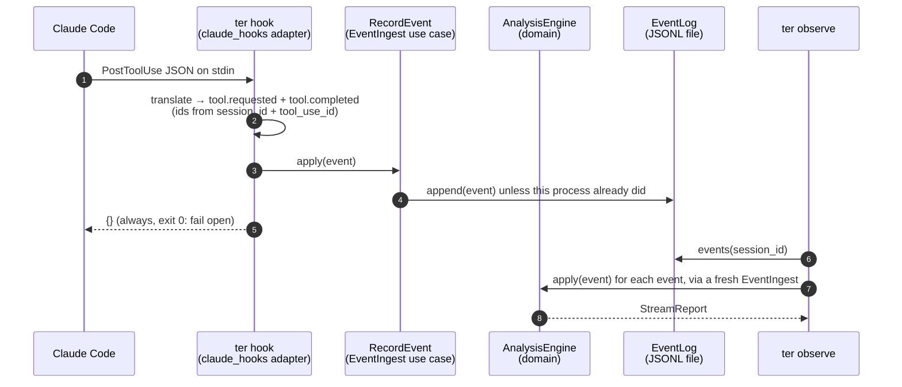

# L1 Observed: the event stream as the core boundary

At L1 every analysis TER runs is a fold over `ter.event` events. A session
recorded as a Claude Code transcript and a session observed live through
hooks go through the same engine, one event at a time, so the live report and
the batch report of the same events are the same value.

## Requirements

| Id | Requirement | Verified by |
|---|---|---|
| TER-OBS-001 | TER shall accept every live and recorded observation through the EventIngest port as ter.event events. | `tests/contract/test_ingest_wiring.py`, `tests/contract/test_event_ingest.py` |
| TER-ANL-011 | When TER applies one new event to a live session, TER shall update the session state without reprocessing earlier events. | `tests/unit/test_ter4_stream_incremental.py` |
| TER-OBS-003 | When a PostToolUse hook event is received, the hook adapter shall append a normalised `tool.completed` event within 50 ms at the 95th percentile. | `tests/unit/test_ter4_claude_hooks.py::test_post_tool_use_is_appended_within_50ms_at_p95` |
| TER-OBS-004 | If an event arrives with an identity already recorded, then TER shall discard it without changing analysis state. | `tests/unit/test_ter4_stream*.py`, `tests/contract/test_event_ingest.py`, `tests/contract/test_hook_payloads.py` |
| TER-ANL-010 | TER shall produce identical reports for a session analysed incrementally and analysed in batch. | `tests/equivalence/test_live_static.py`, property tests, `tests/golden/test_stream_report_snapshot.py` |
| TER-OBS-008 | While the maturity ceiling is L1 Observed, the hook adapter shall return an empty hook response to Claude Code. | `tests/unit/test_ter4_claude_hooks.py::TestRunHook`, `tests/unit/test_ter4_cli.py` (hook commands print `{}`) |
| TER-SRC-005 | The session source shall account for at least 99 percent of records in every session of the reference corpus, each record either mapped to events or classified as a documented metadata type. | `tests/unit/test_ter4_corpus_coverage.py` against `tests/fixtures/corpus/reference-record-types.json` (real sessions; see [corpus.md](corpus.md#coverage-of-real-record-types)) |
| TER-SRC-024 | When a Claude Code session records a prompt that the developer queued while the agent was working, the session source shall emit one intent.stated event for it in file order. | `tests/unit/test_ter4_corpus_coverage.py` |
| TER-OBS-012 | When the hook check runs on recorded hook payloads and transcripts, TER shall report for each session the share of hook events whose id matches a session-source event, without reproducing payload content. | `tests/unit/test_ter4_hook_check.py` |

## Flow



Every observation enters analysis through the `EventIngest` port
(TER-OBS-001): live hooks apply each event as it fires, and every recorded
path (a Claude Code transcript, a GARE run, a replayed event log, and the L2
`explain`/`a3` commands) applies its events, in order, to a fresh
`EventIngest` built by the composition root (`ter.bootstrap.make_ingest`)
before reading the report or explanation. `tests/contract/test_ingest_wiring.py`
spies on that factory for each path, and checks statically that nothing
outside the domain folds events around the port.

Applying one event reads only that event and tokenizes its text once, however
long the session is; a repeated id reads only the id (TER-ANL-011,
`tests/unit/test_ter4_stream_incremental.py`, which counts field reads on
instrumented events).

A hook is a new process per event, so the hook path (`RecordEvent`) only
appends: its cost does not grow with the session (the cold-process benchmark
holds it under 50 ms at p95 on a 2,000-event log). The log may therefore hold
an event twice (a PostToolUse repeats its PreToolUse request; two hook
processes race), and analysis discards the repeat by id. A long-lived process
uses `ObserveEvent` instead, which keeps an engine per session, replays the
log once, and appends each new event before applying it, so a failed append
can be retried.

A hook that cannot record an event (bad JSON, a full disk) still prints `{}`
and exits 0, and writes `ter hook: event not recorded: <reason>` to stderr.

`UserPromptSubmit` carries no id for the submission, so a prompt's id includes
the second it was received: the same text submitted twice counts twice, and
one submission seen twice within a second (the hook registered in two settings
files) counts once.

## Hook to event mapping

| Hook | `ter.event` output | Id key |
|---|---|---|
| `UserPromptSubmit` | `intent.stated` (user), text = `prompt` | session + hash of prompt + second received |
| `PreToolUse` | `tool.requested` (assistant), tool kind from the Claude Code tool map, arguments = `tool_input` | session + `tool_use_id` (else hash of tool name and input) |
| `PostToolUse` | the same `tool.requested` as PreToolUse, plus `tool.completed` (tool), text = `tool_response` | as above; the completion's `parent_id` is the request |
| `Stop` | `task.completed` (system), empty text | session + the turn it closes (last main-chain `assistant` uuid in `transcript_path` written by the receive time); session + second received when the transcript cannot be read |
| `SubagentStop` | `subagent.completed` (system) in the parent session, text = `agent_type` when sent | session + `agent_id` when sent, else the exact receive time (parallel subagents can finish within one second) |
| `SessionStart`, `SessionEnd`, `SubagentStart`, `PreCompact`, `Notification` | none (status `lifecycle`) | n/a |
| anything else, or a malformed payload | none (status `ignored`, with a reason) | n/a |

PostToolUse repeats the request because many installations register only
PostToolUse. Its request carries the id PreToolUse would produce, so where
both hooks run the second copy is discarded by TER-OBS-004.

Known limits of hook identity: prompts are told apart only by text and the
second they were received (hooks carry no prompt id), and tool calls without
a `tool_use_id` are keyed by content. Hook events carry `sequence = 0`; order is the order of the
log. Prompt and tool event ids differ from transcript event ids for the same
session; equivalence holds per event stream, not across the two sources.

Stops are the exception: one id rule serves both sides
(`ter/adapters/claude_code_turns.py`). The session source derives a
`task.completed` for each main-chain `system` record with subtype
`stop_hook_summary` (Claude Code writes it after the Stop hooks ran), keyed by
the last main-chain `assistant` record before it; the Stop hook keys its event
by the last such record in the transcript tail when the payload arrived. Both
use `make_event_id(session_id, turn_uuid, "stop", "task.completed")`. The
session source derives no `subagent.completed` events.

### Checking recordings against transcripts (TER-OBS-012)

`python -m ter hooks check RECORDINGS TRANSCRIPTS [--json FILE]` replays what
`ter hook --record` saved through the live hook path (`claude_hooks.derive`),
reads each session's transcript through the session source, and reports per
session: payload counts and field names by hook, hook-derived and
transcript-derived event counts by kind, per kind the matched and unmatched
ids with a reason for each miss (TER-OBS-007), and per Stop payload whether
its id equals the session source's for the same stop (TER-OBS-005). The
report holds no payload content, so it is how TER-OBS-005 and TER-OBS-007
get checked on real recordings that cannot leave their owner's machine
(issue #35). Both stay `planned` until such a run is reported. See
[the hooks guide](../guides/hooks.md#checking-recordings-against-transcripts).

## Observables (`StreamReport`)

| Field | Meaning |
|---|---|
| `by_kind`, `by_tool`, `by_class` | Event counts by `EventKind`, by `ToolKind` (requests), and generated / user / tool / lifecycle |
| `tokens_by_class` | Text-token estimates from the injected tokenizer (`tokens_exact` says how far to trust them) |
| `usage` | Provider-reported input, output, cache-write and cache-read totals |
| `duplicate_tool_calls` | Requests with the same tool kind and canonical arguments as an earlier one |
| `repeated_reads` | `fs.read` paths read more than once, with counts |
| `orphan_results` | `tool.completed` events whose call was never requested |
| `open_requests` | Requested, not yet completed: work in progress |
| `edits_since_validation`, `peak_edits_without_validation` | `fs.edit`/`fs.write` requests since the last `exec.shell` |
| `timeline` | One row per accepted event with its tokens and the signals it raised |

Each `apply` is O(1) amortised in session length: counters, hash sets and an
insertion-ordered map of open requests. Redelivered events (same id) are
discarded before any state changes.

## Using it

```bash
python -m ter observe session.jsonl --timeline      # a recorded transcript
python -m ter observe --event-log ~/.cache/ter/events # what hooks recorded
python -m ter hook                                  # hook entry: payload on stdin
python -m ter hooks check REC_DIR ~/.claude/projects  # recordings vs transcripts
```

Register the hook in `.claude/settings.json`:

```json
{
  "hooks": {
    "UserPromptSubmit": [{"hooks": [{"type": "command", "command": "python -m ter hook"}]}],
    "PostToolUse": [{"matcher": "*", "hooks": [{"type": "command", "command": "python -m ter hook"}]}]
  }
}
```

The log directory defaults to `ter/events` under `$XDG_CACHE_HOME` (else
`~/.cache`) and follows `TER_EVENT_LOG_DIR`. The log holds prompts and tool
output in plain text, so the directory is created `0700` and each file `0600`,
and an existing one that others can read is tightened. The TER 3 `ter hook monitor` is unchanged.

## Where the code lives

| Layer | Module |
|---|---|
| domain | `ter/domain/stream.py`: `AnalysisEngine`, `StreamReport`, `Signals`, `analyse_batch` |
| ports | `ter/ports/driving.py`: `EventIngest` (`apply`, `report`, `explain`); `ter/ports/driven.py`: `EventLog` |
| application | `ter/application/observe.py`: `ObserveEvent`, `RecordEvent`, `AnalyseTrace`, `AnalyseEventLog`, `ingest_all` |
| driving adapters | `ter/adapters/driving/claude_hooks/`, `ter/adapters/driving/cli.py` |
| driven adapters | `ter/adapters/driven/event_log/` (JSONL), `InMemoryEventLog` |
| shared data | `ter/adapters/claude_code_tools.py`: the Claude Code tool map, used by the JSONL source and the hooks adapter |
| shared rule | `ter/adapters/claude_code_turns.py`: the turn a stop closes and the stop id, used by the JSONL source and the Stop hook |
| hook check | `ter/adapters/driving/claude_hooks/check.py`: `python -m ter hooks check` |

The tool map moved out of `ter.adapters.driven.claude_code` (which keeps a
re-export) so the hook entry point does not import the transcript reader,
and through it the TER 3 loader and numpy, on every hook call.
