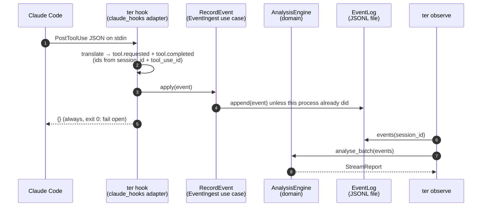

# L1 Observed: the event stream as the core boundary

At L1 every analysis TER runs is a fold over `ter.event` events. A session
recorded as a Claude Code transcript and a session observed live through
hooks go through the same engine, one event at a time, so the live report and
the batch report of the same events are the same value.

## Requirements

| Id | Requirement | Verified by |
|---|---|---|
| TER-OBS-003 | When a PostToolUse hook event is received, the hook adapter shall append a normalised `tool.completed` event within 50 ms at the 95th percentile. | `tests/unit/test_ter4_claude_hooks.py::test_post_tool_use_is_appended_within_50ms_at_p95` |
| TER-OBS-004 | If an event arrives with an identity already recorded, then TER shall discard it without changing analysis state. | `tests/unit/test_ter4_stream*.py`, `tests/contract/test_event_ingest.py`, `tests/contract/test_hook_payloads.py` |
| TER-ANL-010 | TER shall produce identical reports for a session analysed incrementally and analysed in batch. | `tests/equivalence/test_live_static.py`, property tests, `tests/golden/test_stream_report_snapshot.py` |
| TER-OBS-008 | While the maturity ceiling is L1 Observed, the hook adapter shall return an empty hook response to Claude Code. | `tests/unit/test_ter4_claude_hooks.py::TestRunHook`, `tests/unit/test_ter4_cli.py` (hook commands print `{}`) |

## Flow



A hook is a new process per event, so the hook path (`RecordEvent`) only
appends: its cost does not grow with the session (the cold-process benchmark
holds it under 50 ms at p95 on a 2,000-event log). The log may therefore hold
an event twice (a PostToolUse repeats its PreToolUse request; two hook
processes race), and analysis discards the repeat by id. A long-lived process
uses `ObserveEvent` instead, which keeps an engine per session, replays the
log once, and appends each new event before applying it, so a failed append
can be retried.

A hook that cannot record an event (bad JSON, a full disk) still prints `{}`
and exits 0, and writes `ter hook: event not recorded: <reason>` to stderr.

`UserPromptSubmit` carries no id for the submission, so a prompt's id includes
the second it was received: the same text submitted twice counts twice, and
one submission seen twice within a second (the hook registered in two settings
files) counts once.

## Hook to event mapping

| Hook | `ter.event` output | Id key |
|---|---|---|
| `UserPromptSubmit` | `intent.stated` (user), text = `prompt` | session + hash of prompt + second received |
| `PreToolUse` | `tool.requested` (assistant), tool kind from the Claude Code tool map, arguments = `tool_input` | session + `tool_use_id` (else hash of tool name and input) |
| `PostToolUse` | the same `tool.requested` as PreToolUse, plus `tool.completed` (tool), text = `tool_response` | as above; the completion's `parent_id` is the request |
| `Stop` | `task.completed` (system), empty text | session + second received |
| `SubagentStop` | `subagent.completed` (system) in the parent session, text = `agent_type` when sent | session + `agent_id` when sent, else second received |
| `SessionStart`, `SessionEnd`, `SubagentStart`, `PreCompact`, `Notification` | none (status `lifecycle`) | n/a |
| anything else, or a malformed payload | none (status `ignored`, with a reason) | n/a |

PostToolUse repeats the request because many installations register only
PostToolUse. Its request carries the id PreToolUse would produce, so where
both hooks run the second copy is discarded by TER-OBS-004.

Known limits of hook identity: prompts are told apart only by text and the
second they were received (hooks carry no prompt id), and tool calls without
a `tool_use_id` are keyed by content. Hook events carry `sequence = 0`; order is the order of the
log. Hook event ids differ from transcript event ids for the same session;
equivalence holds per event stream, not across the two sources.

## Observables (`StreamReport`)

| Field | Meaning |
|---|---|
| `by_kind`, `by_tool`, `by_class` | Event counts by `EventKind`, by `ToolKind` (requests), and generated / user / tool / lifecycle |
| `tokens_by_class` | Text-token estimates from the injected tokenizer (`tokens_exact` says how far to trust them) |
| `usage` | Provider-reported input, output, cache-write and cache-read totals |
| `duplicate_tool_calls` | Requests with the same tool kind and canonical arguments as an earlier one |
| `repeated_reads` | `fs.read` paths read more than once, with counts |
| `orphan_results` | `tool.completed` events whose call was never requested |
| `open_requests` | Requested, not yet completed: work in progress |
| `edits_since_validation`, `peak_edits_without_validation` | `fs.edit`/`fs.write` requests since the last `exec.shell` |
| `timeline` | One row per accepted event with its tokens and the signals it raised |

Each `apply` is O(1) amortised in session length: counters, hash sets and an
insertion-ordered map of open requests. Redelivered events (same id) are
discarded before any state changes.

## Using it

```bash
python -m ter observe session.jsonl --timeline      # a recorded transcript
python -m ter observe --event-log ~/.cache/ter/events # what hooks recorded
python -m ter hook                                  # hook entry: payload on stdin
```

Register the hook in `.claude/settings.json`:

```json
{
  "hooks": {
    "UserPromptSubmit": [{"hooks": [{"type": "command", "command": "python -m ter hook"}]}],
    "PostToolUse": [{"matcher": "*", "hooks": [{"type": "command", "command": "python -m ter hook"}]}]
  }
}
```

The log directory defaults to `ter/events` under `$XDG_CACHE_HOME` (else
`~/.cache`) and follows `TER_EVENT_LOG_DIR`. The log holds prompts and tool
output in plain text, so the directory is created `0700` and each file `0600`,
and an existing one that others can read is tightened. The TER 3 `ter hook monitor` is unchanged.

## Where the code lives

| Layer | Module |
|---|---|
| domain | `ter/domain/stream.py`: `AnalysisEngine`, `StreamReport`, `Signals`, `analyse_batch` |
| ports | `ter/ports/driving.py`: `EventIngest`; `ter/ports/driven.py`: `EventLog` |
| application | `ter/application/observe.py`: `ObserveEvent`, `RecordEvent`, `AnalyseTrace`, `AnalyseEventLog` |
| driving adapters | `ter/adapters/driving/claude_hooks/`, `ter/adapters/driving/cli.py` |
| driven adapters | `ter/adapters/driven/event_log/` (JSONL), `InMemoryEventLog` |
| shared data | `ter/adapters/claude_code_tools.py`: the Claude Code tool map, used by the JSONL source and the hooks adapter |

The tool map moved out of `ter.adapters.driven.claude_code` (which keeps a
re-export) so the hook entry point does not import the transcript reader,
and through it the TER 3 loader and numpy, on every hook call.
