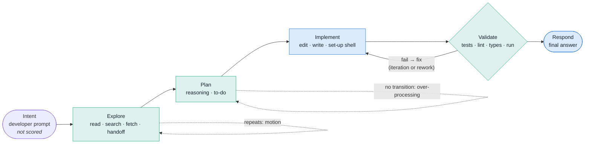

# L2 Explained: the Lean model, evidence and the A3

At L2 TER says *why* a session was inefficient, not only how much. Every
event in a session is placed on an agentic value stream and classified as
value-adding, necessary but non-value-adding, or avoidable. Eleven detectors
look for Lean wastes, each finding cites the events it rests on, and an A3
report turns findings into countermeasures: lines for `CLAUDE.md`, Claude
Code hooks and settings. All of it is computed from the session's event
stream alone; repository evidence arrives at L3.

The model and its trade-offs are recorded in
[ADR 0004](../decisions/0004-lean-waste-model.md).

## The agentic value stream



| Stage | Events | Default class (basis `stage:…`) |
|---|---|---|
| Intent | `intent.stated` | none: developer input is never scored |
| Explore | `fs.read`, `fs.search`, `net.fetch`, `agent.handoff`, exploring shell (`ls`, `git status`, `grep`) | necessary non-value-adding |
| Plan | `reasoning`, `plan.todo` | necessary non-value-adding |
| Implement | `fs.edit`, `fs.write` (value-adding); changing or other shell (`pip install`, `git commit`) | value-adding / necessary NVA |
| Validate | shell recognised as a check: test runners, linters, type checkers, build, ad-hoc `python -c` | necessary non-value-adding |
| Respond | `response`: the last one before the next prompt delivers the outcome | value-adding (final) / necessary NVA (narration) |

A tool result belongs to its request's stage. Wall time is the gap each event
closes: the gap before a tool result is the tool's running time and belongs
to its request; every other gap belongs to the event it precedes.

A confident waste finding reclassifies the share of each event it claims as
**avoidable**; an uncertain one moves that share to a separate **uncertain**
bucket; the rest keeps its stage class. `Classification.basis` names the rule
or finding id behind every event's class.

## Detector catalogue

Detectors live in `ter/domain/lean/detectors.py`, behind the `WasteDetector`
protocol, registered in `DEFAULT_REGISTRY`. Findings below confidence 0.70
are **uncertain**: shown, never suppressed, never counted as waste.

| Detector | Lean waste | Evidence it cites | Confidence rule | Countermeasure |
|---|---|---|---|---|
| `repeated_tool_call` (pts 19, 39) | over-processing | both calls and results | 0.90 same input and output, nothing edited between; 0.85 validation re-run without edits; 0.75 edits between but identical output; 0.50 an output not observed. Different output: none | CLAUDE.md "reuse results"; PreToolUse(Bash) hook blocking identical commands on an unchanged tree |
| `repeated_exploration` (18, 28, 36) | motion | both reads/searches and results | 0.85 same arguments, identical output, file not edited between; 0.55 output not observed. Re-read after an edit or of another range: none | CLAUDE.md "do not re-read"; a "Where things live" map; PreToolUse(Read) hook blocking unchanged re-reads |
| `rework_cycle` (26, 37) | rework | failed run, failure, fix edits, next run | same command, edits between: 0.80 when the next run fails with the same failure signature, 0.90 for the second in a row. Pass or different failure: iteration, no finding | CLAUDE.md "same failure twice → stop and re-diagnose"; PostToolUse(Bash) hook flagging an identical failure |
| `unvalidated_implementation` (25) | defects (risk) | unvalidated edits and the response | per prompt, after a response: 0.85 no check in the session; 0.75 checks only earlier; 0.50 docs only; 0.85 responded after a failing check | CLAUDE.md "validation is part of done" with the session's own test command; PostToolUse(Edit\|Write) hook running it |
| `premature_implementation` (22, 23) | defects (risk) | the prompt and the edit | 0.75 in-place edit of a file never read, written or named in output; 0.45 new file before any exploration | CLAUDE.md "read before editing"; `permissions.defaultMode: plan` |
| `excessive_planning` (24) | over-processing | the planning run | ≥ 4 planning steps with no action between; 0.55 + 0.05 per step, ≤ 0.90; steps beyond the second are waste | CLAUDE.md "act after planning"; plan-mode practice |
| `fragmented_edits` (27) | over-processing | the edits and results | ≥ 3 consecutive edits to one file; 0.70 + 0.05 per extra, ≤ 0.85; only round-trip overhead is waste | CLAUDE.md "one MultiEdit per coherent change" |
| `unused_context` (21, 34, 35) | inventory | the read and its result | after a response, nothing later names the file or what it defines: 0.65 (defines names) or 0.55 — always uncertain at L2 | CLAUDE.md "read with a purpose"; verify first, then map or `/compact` |
| `unnecessary_handoff` (29, 30) | handoffs | handoff, result, the agent's own call | a later own call shares ≥ 3 key words and ≥ 50% of the smaller set: 0.45 + 0.40 × overlap, ≤ 0.85 | CLAUDE.md "when to delegate"; `permissions.deny: ["Task"]` for small tasks |
| `repeated_reasoning` (17) | over-processing | both reasoning blocks | same prompt, no edit between, ≥ 3 shared words, ≤ 25% new words: 0.85 − novelty (− 0.10 under 6 words) | CLAUDE.md "act instead of restating" |
| `regeneration` (20) | overproduction | earlier write or read, the rewrite | whole-file write keeping ≥ 80% of the agent's own earlier write: 0.80; ≥ 60% of a file just read: 0.60 | CLAUDE.md "Edit, not Write, for existing files"; PreToolUse(Write) hook |

Validation outcomes are read from tool output with specific markers
(`FAILED`, `N failed`, `Traceback`, `error:`, `exit code N`…); anything else is
*unknown* and forms no cycle. Failure signatures hash the failing lines with
timings, addresses and timestamps removed.

## Scorecard (no single opaque score)

The scorecard has six separate dimensions (`ter.domain.lean.scorecard`,
TER-SCR-001), each a list of named measures with units; an unknown measure is
`null`/"unknown", never 0. The first five measure agent behaviour and come
from the analysis alone; *outcome* is judged apart from them
([outcome.md](outcome.md)). The A3 JSON carries them under
`analysis.dimensions`, and the A3 page as the "Scorecard dimensions" table.

| Dimension | Measures |
|---|---|
| Efficiency | TER, **Software Value Efficiency**, value-adding share and avoidable share of generated tokens |
| Flow | Agentic flow efficiency by tokens and by time, peak WIP (and the event it follows), WIP at the end |
| Quality | Validation runs, runs that passed and failed (read from their output), iteration and rework cycles, share of edits covered by a later validation run |
| Cost | Generated and context tokens, agent time, avoidable generated tokens, context tokens and time |
| Risk | Risk findings, uncertain findings, edits no validation run covered, failing checks never seen passing again |
| Outcome | The verdict (`accepted`, `rejected`, `incomplete`, or `unknown` without evidence), generated tokens per verified outcome |

Definitions of the headline measures:

| Measure | Definition |
|---|---|
| Agentic flow efficiency (tokens, time) | Share of generated tokens (agent wall time) *progressing* or *recovering* (productive iteration), against *repeating*, *reworking*, *waiting* (unnecessary handoffs) and *inventory* (unused context). Only confident findings move tokens out of progress. |
| Activity classes | Generated tokens and time by value-adding, necessary NVA, avoidable, uncertain. Sums equal the totals. |
| Waste cost | Avoidable generated tokens, context tokens re-entering the window, and seconds. |
| TER | The TER 3 ratio with the method used (`--ter offline` pins the deterministic tokenizer and embedder; `--ter model` uses sentence-transformers). |
| Software Value Efficiency | See below; reported next to TER in the A3 tiles, the A3 JSON (`analysis.scorecard.software_value_efficiency`, the key after `ter`), `explain --json` and the `explain` text. |
| Findings | Confident, uncertain and risk counts; iteration and rework cycles. |
| Composite | Only with its composition: the unweighted mean of flow efficiency (tokens), flow efficiency (time) and TER, whichever exist. |

### Software Value Efficiency

SVE (point 81, TER-SCR-003) is value delivered toward a *verified* outcome per
unit of resource consumed. Value-adding work is the Lean activity class above
(edits that change the software, the final response); the outcome verdict says
whether that work delivered anything.

| Verdict | Status | `tokens` | `time` | Per outcome |
|---|---|---|---|---|
| accepted | `measured` | value-adding generated tokens ÷ generated tokens | value-adding agent seconds ÷ agent seconds | `tokens_per_outcome` = generated tokens, `seconds_per_outcome` = agent seconds |
| rejected | `no_value` | 0 | 0 | none (no verified outcome) |
| incomplete, or no `--outcome` | `unknown` | none | none | none |

Value is never inferred from tokens: without outcome evidence SVE is
*unknown*, and the reason says so. Money cost waits for cost on the L2
scorecard, so resources are tokens and time.

### Value per unit of resource, never token count alone

Every efficiency judgement is a ratio of value (or progressing work) to the
resource spent (TER-LEN-005): flow efficiency, activity shares and SVE.
Counting every text three times as many tokens changes none of them, nor any
finding or the verdict; a session that used fewer tokens and delivered nothing
scores below one that delivered an accepted change. Token minimisation is not
a goal, and the A3 says so under the scorecard.

## Work in progress

`LeanAnalysis.wip` (`ter.domain.lean.wip`, TER-WIP-001, points 31 and 32)
counts unresolved work after every event, lifecycle events included, as a fold
inside the incremental analyser (O(1) amortised per event; batch equals live).

| Kind | Opens | Resolves |
|---|---|---|
| Edits | an `fs.edit` or `fs.write` request | the result of a validation run requested after it, whatever it says (a failure becomes WIP of its own) |
| Failures | a validation result read as failed, keyed by its normalised command | a later run of the same command that passes; a different command does not (L2 cannot tell which checks a command covers) |
| Tasks | each to-do item (`plan.todo` with a `todos` list) not `completed`, replaced by each new list; each `agent.handoff` request | the to-do list marking it completed; the handoff's result |
| Hypotheses | an exploration request (read, search, fetch, exploring shell) on a subject not already open: the file path, otherwise the tool kind and subject | an edit or write of that path (acted on), or the end of the turn (a new prompt or `task.completed`) |

An intermediate response does not end a turn. Unknown validation outcomes open
and close nothing. The report has the series (`[event_id, hypotheses, tasks,
edits, failures]` per event), the peak (first sample with the largest total),
the peak of each kind, the final sample and the event ids that opened every
item still open at the end. The A3 draws the series as a stacked chart with
the peak marked, adds a "Peak WIP" tile, and `explain` prints a WIP line.

## Lean concepts and their measures

`ter.domain.lean.concepts.LEAN_MEASURES` maps each Lean concept TER-LEN-006
names to at least one measure the code computes: a detector
(`detector:<id>`) or a field of the A3 JSON (`a3:<path>`). A test resolves
every path in a real A3 and looks every detector up in the registry; the A3
lists the map under "Evidence and method" and in its JSON (`lean_concepts`).

| Concept | Measures |
|---|---|
| Value | `a3:analysis.scorecard.activity_tokens.value_adding`, `a3:analysis.scorecard.software_value_efficiency.tokens` |
| Flow | `a3:analysis.scorecard.flow_efficiency_tokens`, `a3:analysis.scorecard.flow_efficiency_time` |
| Pull | `detector:unused_context` (context no later action pulled), `a3:analysis.wip.peak_by_kind.hypotheses` (exploration not yet pulled into an action) |
| WIP | `a3:analysis.wip.series`, `a3:analysis.wip.peak.total` |
| Queues | `a3:analysis.wip.peak_by_kind.edits` (changes queued behind the next check), `a3:analysis.wip.peak_by_kind.tasks` |
| Rework | `detector:rework_cycle`, `a3:analysis.scorecard.flow_tokens.reworking` |
| Defects | `detector:unvalidated_implementation`, `detector:premature_implementation`, `a3:analysis.wip.final.failures` |
| Waiting | `a3:analysis.scorecard.flow_seconds.waiting`, `detector:unnecessary_handoff` |
| Over-processing | `detector:repeated_tool_call`, `detector:repeated_reasoning`, `detector:excessive_planning`, `detector:fragmented_edits` |
| Motion | `detector:repeated_exploration` |

## Evidence graph

`LeanAnalysis.graph` (`ter.evidence/0.1`, exported with `--graph FILE`) has one
node per event (stage, activity class, label) and typed edges from the later
event to the earlier one it rests on: `completes`, `motivated_by` (an action
rests on the observation or prompt before it; an edit also on the last read of
its file and the prompt in force), `validates` (a check covers every edit
since the previous check), `corrects` (an edit after a failed check) and
`repeats` (established by a finding). `EvidenceGraph.ancestors(id)`
reconstructs how a change emerged.

## The A3

```bash
ter a3 session.jsonl --html a3.html --json a3.json --graph evidence.json
python -m ter a3 session.jsonl --html a3.html            # same command
python -m ter explain session.jsonl [--json]              # findings as text or JSON
```

One self-contained page (no scripts, no requests, light and dark themes,
prints on A3 landscape) in A3 order: **1 Background** (the developer's
prompts and a problem statement) · **Scorecard** (tiles with TER and SVE side
by side and peak WIP, then the six dimensions) · **2 Current state** (value
stream map: stages with steps, tokens, context and time; stages with
confident waste outlined in red with a badge; avoidable and uncertain shares
per stage) · **3 Analysis** (waste Pareto of generated tokens, each event
counted once under the finding the scorecard charged it to, so the bars add
up to the scorecard's waste; activity-class 100% bar, flow by
tokens and by time, WIP over the session, fail → fix cycles) · **4 Root causes** (findings with
confidence, cost and evidence event ids) · **5 Countermeasures** (per fired
detector: CLAUDE.md lines, hook settings and scripts, settings) · **6
Follow-up** (what to measure next run and where in the JSON).

## Requirements

The behaviour is specified by the EARS catalogue (`requirements/l2_explained.yaml`,
plus `TER-GRF-002` and `TER-GRF-003` in `l3_grounded.yaml`); tests cite those
ids with `@pytest.mark.req`. The ids this page used before the catalogue
existed map as follows.

| Former id | Catalogue id | Status | Verified by |
|---|---|---|---|
| TER-LEAN-001 | TER-LEN-001, TER-LEN-007, TER-LEN-002 | verified | `tests/unit/test_ter4_lean_analysis.py`, `test_ter4_lean_properties.py` |
| TER-LEAN-002 | TER-DET-001, TER-ANL-020 | verified | `test_ter4_lean_properties.py` |
| TER-LEAN-003 | TER-ANL-021 (threshold `UNCERTAIN_BELOW` = 0.70) | verified | `test_ter4_lean_properties.py`, `test_ter4_lean_analysis.py` |
| TER-LEAN-004 | TER-LEN-008 | verified | properties, `tests/golden/test_lean_snapshots.py` |
| TER-LEAN-010, 011, 019, 020 | TER-DET-002 (and TER-DET-010 for re-run validation) | verified | `tests/unit/test_ter4_lean_detectors.py` |
| TER-LEAN-012 | TER-DET-006 | verified | same, `iteration_converges` golden session |
| TER-LEAN-013, 014, 015 | TER-DET-005 | verified | `test_ter4_lean_detectors.py` |
| TER-LEAN-016 | TER-DET-007 | planned: fragmented edits are over-processing here; unused traversals as motion need L3 | `test_ter4_lean_detectors.py` |
| TER-LEAN-017 | TER-DET-004 | planned: unused context is listed, its token cost is not yet asserted | `test_ter4_lean_detectors.py` |
| TER-LEAN-018 | TER-DET-008 | planned: model escalations need routing | `test_ter4_lean_detectors.py` |
| TER-LEAN-019 | TER-LEN-004 | planned: `excessive_planning` can count a planning step that adds a decision | `test_ter4_lean_detectors.py` |
| TER-LEAN-030 | TER-GRF-002, TER-GRF-003 (TER-GRF-001 planned: decision nodes) | verified | `test_ter4_lean_analysis.py`, properties, `test_ter4_a3.py` |
| TER-LEAN-040 | TER-SCR-002, TER-FLW-001, TER-SCR-001 | verified | `test_ter4_lean_analysis.py`, properties, `test_ter4_wip_scorecard.py` |
| TER-LEAN-050 | TER-ANL-010 | verified | `tests/equivalence/test_live_static.py`, properties |
| TER-LEAN-060 | TER-ARC-002 | planned: only detectors are plugins so far | `test_ter4_lean_analysis.py` |
| TER-A3-001, 005 | TER-RPT-003 | verified | `test_ter4_lean_analysis.py`, `test_ter4_a3.py`, golden A3 JSON |
| TER-A3-002 | TER-RPT-004 | verified | `tests/unit/test_ter4_a3.py`, golden A3 HTML |
| TER-A3-003 | TER-RPT-005 | verified | `test_ter4_lean_analysis.py` |
| TER-A3-004 | TER-LEN-008 | verified | `tests/golden/test_lean_snapshots.py` |
| TER-A3-006 | TER-ANL-012 | verified | `tests/contract/test_ter_scorer.py`, golden TER check |
| (new) | TER-WIP-001, TER-SCR-003, TER-LEN-005, TER-LEN-006 | verified | `tests/unit/test_ter4_wip_scorecard.py` |

Tests that only partly prove a planned requirement (TER-DET-004, 007, 008,
TER-LEN-004, TER-ARC-002, TER-GRF-001) do not cite it, so the
trace gate never suggests promoting it early; `requirements/points.yaml`
names those tests as the points' verification instead.

## Brief points: definition of done and navigation rule

Status: **done** at L2, **partial** (what remains, and at which level), or
**later**. The rule is what future changes must keep true. The generated
index, [points.md](points.md), is authoritative; where this table and the
catalogue review differ, the status here has been aligned with it.

| Pt | Status | Definition of done | Rule for long-term navigation |
|---|---|---|---|
| 3 | done | Value, waste, flow, quality, cost, risk and outcome are named scorecard dimensions (`Dimension`, `ScorecardDimension`) computed from recorded events and the outcome verdict | New measures join a `Dimension`, never folded into another |
| 7 | partial | Waste = cost claimed by a finding that did not advance the requested outcome; judging value against the stated intent (TER-LEN-003) is later | A waste finding must cite what it consumed (`waste_events`) |
| 8 | partial | Reasoning is waste only when restated with ≤ 25% new words, or in a 4+ step run without action; the planning rule can still count a step that adds a decision (TER-LEN-004) | Never flag reasoning by length |
| 9 | done | Flow efficiency counts productive iteration as flow; a test cuts every token count to a third at constant value and no efficiency judgement or verdict changes (TER-LEN-005) | No detector threshold may be a token count |
| 10 | done | Headline is flow efficiency and SVE, not token totals; the A3 names token minimisation as a non-goal | Reports lead with flow and outcome risk |
| 11 | done | `ter.domain.lean` + ADR 0004; concept-to-measure map in `concepts.py` | Lean concepts change only with an ADR |
| 12 | done | Every concept has computed measures in `LEAN_MEASURES` (table above); pull and queues are proxied by unused context and WIP at L2 | Map a new concept onto `LeanWaste`/`FlowState` or `LEAN_MEASURES` before adding a detector |
| 13 | done | Six-stage value stream, `STAGE_ORDER` | Stage order is fixed; new tools map onto an existing stage |
| 14 | done | Prompts, reasoning, tool calls, reads, edits, tests, responses are events with stages | Stages come from tool *kinds*, never native names |
| 15 | done | Three activity classes with a basis per event | Every classified event carries a basis |
| 16 | done | Token and time proportions per class, sums equal totals | Proportions are apportioned exactly (largest remainder) |
| 17 | done | `repeated_reasoning` | Restatement is measured against earlier reasoning *and* the prompt |
| 18 | done | `repeated_exploration` | Re-reads after an edit of that file are never waste |
| 19 | done | `repeated_tool_call` | Output must be compared, not only input |
| 20 | done | `regeneration` | Only whole-file writes retaining existing lines |
| 21 | partial | Unused reads flagged (uncertain); "excessive" needs repository scope (L3) | Stay uncertain until repository evidence exists |
| 22 | partial | `premature_implementation` (edit of unseen file); sufficiency needs L3 | Knowledge = read, written, or named in output |
| 23 | done | `premature_implementation` | Risk findings claim no cost |
| 24 | done | `excessive_planning` | Structural run length, never reasoning tokens |
| 25 | done | `unvalidated_implementation` | Judged per prompt, only after a response |
| 26 | done | `rework_cycle` | Same command, edits between, same signature |
| 27 | done | `fragmented_edits` | Only overhead is waste, never the change |
| 28 | partial | Repeated reads are motion (`repeated_exploration`); unused traversals are uncertain inventory, not motion, until L3 | As 18 |
| 29 | done | `unnecessary_handoff` | The handoff is the waste; the agent's own call is kept |
| 30 | partial | Handoff wait time lands in the *waiting* flow state; model escalation needs routing (L5) | Waiting is attributed only through findings |
| 31, 32 | done | `WipTracker` counts unresolved hypotheses, tasks, edits and failures after every event; the A3 shows the series and its peak | WIP is a fold: O(1) amortised per event, batch equals live |
| 33 | later | The WIP–efficiency correlation needs the L6 dataset (issue #44) | A finding never fires on WIP alone without that evidence |
| 34 | done | `unused_context` (inventory) | As 21 |
| 35 | partial | Unused context tokens are costed as context tokens; dated pricing and real data wait on issue #40 | Context and generated tokens are reported separately |
| 36 | partial | Re-read output tokens costed in `repeated_exploration`; dated pricing and real data wait on issue #40 | As 35 |
| 37 | done | `ValidationCycle.verdict` iteration vs rework; iteration is *recovering* flow | A converging cycle is never waste |
| 38 | partial | Exploration is never waste unless repeated or unused (uncertain); intent-aware judgement is L3 | Default for exploration is necessary NVA |
| 39 | done | Validation re-run without edits and identical output | Re-validation after edits is never duplicated validation |
| 40 | done | `evidence`, `waste_events`, `Classification.basis`; property tested | No finding without evidence ids that exist in the trace |
| 71 | partial | Session-scope evidence graph; repository nodes at L3 | Edges always point from later to earlier events |
| 72 | partial | Actions link to motivating observations; decisions as such need L3 | `motivated_by` is structural (preceding observation) |
| 73 | done | `motivated_by` edges | As 72 |
| 74 | partial | Edits link to the prompt and last read of the file; requirement-level links at L3 | Edits always link to the prompt in force |
| 75 | done | `validates` edges | A check validates all edits since the previous check |
| 76 | done | `corrects` edges | Only edits after a *failed* check correct it |
| 77 | partial | `EvidenceGraph.ancestors`; no command prints the reconstruction yet | Graph export schema is versioned (`ter.evidence/0.1`) |
| 79 | done | Agentic flow efficiency (tokens and time) | Defined in this page; changes need an ADR |
| 80 | done | Flow states: progressing, recovering, repeating, reworking, waiting, inventory | Each `LeanWaste` maps to exactly one flow state |
| 81 | done | Software Value Efficiency defined above, computed from the verdict and shown next to TER; unknown without outcome evidence | Not approximated from tokens |
| 82 | done | Six separate scorecard dimensions; the composite shows its parts | No opaque single score |
| 83 | done | Efficiency, flow, quality, cost, risk and outcome | As 3 |
| 84 | done | `Composite` with components, weights and formula | A composite is never shown without its parts |
| 85 | done | Confidence on every finding with a published rule | Every detector publishes `confidence_rule` |
| 86 | done | Uncertain findings shown and bucketed separately | Uncertain never counts as avoidable |
| 91 | partial | Conservative structural thresholds; uncertain below 0.70; the precision floor needs real data (issue #41) | Prefer a missed finding to a false one |
| 139 | partial | Countermeasures derive from findings (TER-RPT-005); intervention policies are L4 (TER-INT-007) | No recommendation from a token threshold |

## Where the code lives

| Layer | Module |
|---|---|
| domain | `ter/domain/lean/`: `model.py`, `facts.py`, `steps.py`, `detectors.py`, `graph.py`, `analysis.py`, `wip.py`, `scorecard.py`, `concepts.py`, `countermeasures.py`, `a3.py`; `AnalysisEngine.explain()` and `explain_batch` in `ter/domain/stream.py` |
| ports | `TerScorer` in `ter/ports/driven.py` |
| application | `ExplainSession` in `ter/application/explain.py` |
| driven adapters | `ter/adapters/driven/ter3/` (`Ter3Scorer`), `FixedTerScorer` fake |
| driving adapters | `ter/adapters/driving/reports/a3.py`, `explain` and `a3` in `ter/adapters/driving/cli.py`; `ter a3` delegates from the TER 3 CLI |
| tests | `tests/unit/test_ter4_lean_*.py`, `test_ter4_a3.py`, `test_ter4_wip_scorecard.py`, `tests/contract/test_ter_scorer.py`, `tests/golden/test_lean_snapshots.py`, `tests/equivalence/test_live_static.py` |

## Known limits

- Validation outcomes are read from output text; `ter.event` has no
  error flag. Unknown outcomes form no cycle.
- Detectors run when an explanation is requested, in time linear in the
  session; the per-event fold stays O(1) amortised.
- Hook-recorded sessions carry no reasoning or responses, so detectors that
  need them (planning, restated reasoning, unvalidated-before-response) stay
  silent on hook logs.
