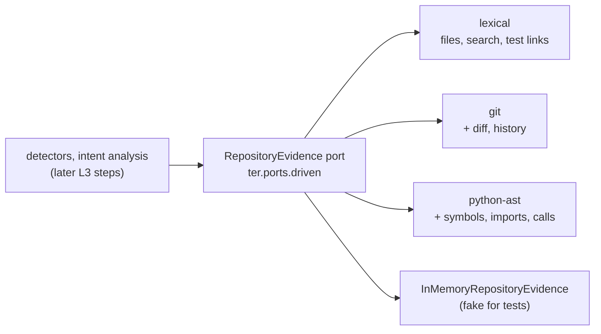

# L3 Grounded: repository evidence behind the analysis

At L3 TER stops judging a session from its event stream alone and asks the
repository what the code says: which files and symbols exist, which tests
import a module, what changed in the working tree and how each file evolved.
All of it comes through one provider-neutral driven port,
`RepositoryEvidence`, served by interchangeable engines that load as
capabilities.

This page covers what is built so far: the port and three engines (steps 1
to 3 of the L3 plan), and the first detectors grounded on them: each task's
expected change surface with the edits outside it, and imports that break
the repository's architecture contracts (step 4). Evidence usage, context
bundles and model routing come in later steps, and the requirements for them
stay `planned` in `requirements/l3_grounded.yaml`.

## Requirements

| Id | Requirement | Verified by |
|---|---|---|
| TER-EVD-001 | TER shall obtain repository evidence only through the provider-neutral RepositoryEvidence port. | `tests/contract/test_repository_evidence.py`, `tests/architecture/test_repository_evidence_boundary.py`, the `provider-neutral-evidence` import contract |
| TER-EVD-002 | The lexical repository evidence adapter shall return identical results for identical repository content. | `tests/unit/test_ter4_repository_evidence.py::TestLexicalDeterminism`, `tests/golden/test_repository_evidence_snapshot.py` |
| TER-EVD-003 | When a detector requests repository evidence for a Python source module, the repository evidence adapter shall return every test module whose import statements import that source module. | contract suite, `TestTestsImporting`, `TestSharedRules` |
| TER-EVD-012 | Where the repository evidence adapter supports the language of a source file, the repository evidence adapter shall return the symbols, imports and call edges of that file from its syntax tree. | `TestPythonSyntax`, golden `repository/python-ast.json` |
| TER-EVD-013 | Where the repository is a Git working tree, the Git repository evidence adapter shall return the current diff and the history of each file. | `TestGitWorkTree`, `TestGitDiff`, `TestGitHistory` |
| TER-ARC-007 | TER shall load repository engines through the ter.capabilities plugin registry. | `TestRepositoryEnginesArePlugins` |
| TER-EVD-006 | TER shall compute the expected change surface of each task and report every edit outside it. | `tests/unit/test_ter4_change_surface.py` (`TestChangeSurface`, `TestUnrelatedModification`, `TestSurfaceExpansion`, `TestGroundedFold`), `tests/unit/test_ter4_grounded_cli.py` |
| TER-EVD-007 | When an edit to a Python module adds an import that breaks a declared import-linter forbidden, layers or independence contract, TER shall report an architectural boundary violation. | `TestBoundaryViolation`, `TestContractRules`, `TestImportLinterReader`, `tests/contract/test_architecture_contracts.py`, the `structure_of` contract tests, `tests/unit/test_ter4_grounded_cli.py` |
| TER-EVD-014 (planned) | Test-to-source links for languages other than Python. | split from TER-EVD-003 |
| TER-EVD-015 (planned) | Boundary violations for contracts TER-EVD-007 does not evaluate: other languages, other contract types, indirect import chains. | split from TER-EVD-007 |

Unless named otherwise, the test classes are in
`tests/unit/test_ter4_repository_evidence.py` (engines) or
`tests/unit/test_ter4_change_surface.py` (grounded detectors). Intent
analysis does not take repository evidence yet (TER-ITN-006, TER-LEN-009),
and live analysis does not read the diff (P062), so P051 and P062 stay
partial.

**Real data still needed.** TER-EVD-006 and TER-EVD-007 are verified on
synthetic sessions and synthetic repositories committed with Git. The points
they serve (P063 change surface, P064 expansion, P065 boundary violations,
P066 unrelated modifications) stay `partial` until the detectors are run on
real sessions together with the repository each session worked in, checked
out at the commit it started from (D4 in the maturity plan), and their
finding rates and false positives are recorded.

## The port



An engine is built for one repository root. Every method returns values from
`ter.domain.repository`, never vendor or IO types:

| Method | Returns | Engines without it |
|---|---|---|
| `files()` | every file, relative to the root, `/`-separated, sorted; no `.git`, `.hg` or `.svn` content, no symbolic links | all have it |
| `text(path)` | a listed file's UTF-8 text | all have it |
| `search(needle, regex=False)` | `TextMatch(path, line, text)` for every line containing `needle`, by path then line; binary and non-UTF-8 files are skipped | all have it |
| `tests_importing(path)` | the test modules whose import statements import the Python module at `path` | all have it (Python only) |
| `structure(path)` | `SourceStructure`: symbols, imports, call edges, or a parse `error` | `None` |
| `structure_of(path, text)` | what `structure(path)` would return if the file held `text`; also for a path the repository does not list (a file a session creates) | `None` |
| `diff()` | `RepositoryDiff`: the working tree against `HEAD` | `None` |
| `history(path)` | `FileCommit`s, newest first | `None` |

A path the repository does not list raises `UnknownPathError`; asking for
the tests of a non-Python file raises `UnsupportedLanguageError`. An engine
says what it cannot do by returning `None`, never by guessing.

Every obligation is a test in `tests/contract/test_repository_evidence.py`,
run against all three engines and the in-memory fake on one synthetic
repository (`tests/contract/repository_fixture.py`).

## Engines

Engines are capabilities (ADR 0005), keyed `RepositoryEvidence.<engine>`
and declared both in `ter.bootstrap.capabilities.BUILTIN_CAPABILITIES` and
as `ter.capabilities` entry points in `pyproject.toml`. Callers get one
through the registry:

```python
from ter.bootstrap.capabilities import repository_evidence

engine = repository_evidence("path/to/repo", "python-ast")  # default: "lexical"
engine.tests_importing("src/pkg/core.py")
```

An installed package adds an engine by declaring a
`RepositoryEvidence.<name>` entry point whose class takes the repository
root (TER-ARC-007). A class that lacks a port method is refused with a
`CapabilityError` naming it.

### `lexical`: the deterministic baseline

Reads files under the root and answers from their text. Every answer depends
only on paths and bytes, not on where the root is, file times or directory
order, so it is the baseline richer engines are measured against (P055). The
golden snapshot `tests/golden/snapshots/repository/lexical.json` freezes its
answers on the synthetic repository.

Import statements are read by pattern: `import a.b`, `import a as b, c`,
`from a import (b, c)`, backslash continuations, and relative imports
resolved against the importing file's package. Being lexical, it also
counts an import statement written inside a string.

### `python-ast`: Python syntax trees

The lexical engine plus `structure()` for `.py` files, from the standard
library's `ast`:

- **symbols**: classes, functions and methods, qualified within the module
  (`Calc.total`, `Service.fetch.inner`), with first and last line;
- **imports**: one `ImportEdge(module, names, line)` per statement, relative
  imports resolved to absolute module names;
- **call edges**: `CallEdge(caller, callee, line, resolved)` for each call
  whose target is a dotted name, attributed to the innermost enclosing
  definition or `<module>`, with `resolved` set to the absolute name when the
  head of the callee is a name the file imports or defines at top level
  (`plus` imported from `.core` as `add` resolves to `pkg.core.add`). Calls
  on other expressions (`f()()`, `x[0]()`) have no name and are left out.

Its test-to-source links use the syntax tree, so an import inside a string
does not count; a test file that does not parse falls back to the lexical
reading. Files in other languages have no structure.

### `git`: diff and history

The lexical engine over the files Git sees (tracked files still on disk and
untracked files that are not ignored), plus:

- `diff()`: staged, unstaged and untracked changes against `HEAD` (or the
  empty tree before the first commit, with `base` `None`). Each
  `FileChange` has a status (`added`, `modified`, `deleted`, `untracked`,
  `type-changed`), added and removed line counts (`None` for binary files)
  and the unified patch.
- `history(path)`: the file's commits, newest first, following renames;
  each `FileCommit` has the commit id, ISO 8601 commit time, author name,
  subject, the file's name in that commit and its line counts there.

Only this engine runs `git`, as a subprocess, with the settings that would
make output depend on user configuration pinned (no colour, no external
diff, no rename detection in diffs, unquoted paths, the C locale, literal
pathspecs). It refuses, with `NotAWorkTreeError`, a directory that is not
the top level of a Git working tree (a plain directory, a subdirectory, a
bare repository), so "no Git" is never mistaken for "no changes". The other
engines return no diff or history without error.

## Grounded analysis: change surface and boundaries

`python -m ter explain` and `python -m ter a3` take the repository a
session worked in:

```bash
git worktree add ../shop-at-start <start-commit>   # the commit the session started from
python -m ter explain session.jsonl --repo ../shop-at-start
python -m ter a3 session.jsonl --repo ../shop-at-start --html a3.html
```

`--repo-engine` picks the engine (default `python-ast`, which the import
graph needs; `lexical` gives the surface without import links). The
repository must be the one at the session's start commit: TER replays the
session's edits on it, so a checkout that already holds them reads as edits
that cannot be replayed. Without `--repo`, `explain` and `a3` are exactly
the L2 commands, and their output is unchanged.

### Computed once, then a fold

`ter.application.ground.ground_session` reads the repository once through
the port and returns a `RepositoryGrounding` (`ter.domain.lean.grounding`),
values only:

- the files, the Python module names and the **import graph** at the start
  commit (which repository files each file imports, and the reverse), from
  syntax trees;
- the **distinctive symbols** each file defines: names a prompt can only
  mean one way, with an inner underscore or an inner capital
  (`tests_importing`, `ExplainSession`; never `run` or `main`);
- the mapping from the session's paths to repository paths. A session's
  tools use absolute paths (`/home/me/shop/src/a.py`); the root is the
  prefix most paths agree on when the rest names a repository file (or,
  for a session that only creates files, a repository directory). A path
  outside that root is outside the repository;
- for each edit and write, the file **after** it, replayed on the start
  commit's text (`replay_edit`: `content` replaces; `old_string` must be
  found, else the file's text is unknown from there on), parsed with
  `structure_of`, and the imports the edit **added**;
- the architecture contracts the repository declares, read through the
  `ArchitectureContracts` port.

The analysis is then given the grounding beside the events
(`explain(..., repository=g)`, `AnalysisEngine.explain(repository=g)`); the
grounded detectors read it like any other index, nothing in the domain does
IO, and batch still equals incremental (`TestGroundedFold`). The grounding
of the TER repository itself (1,000 files) takes under two seconds.

### The expected change surface (TER-EVD-006)

Per task (a prompt and the work up to the next one), built from structure
only, never from token counts or word scores:

1. **Seeds**: the repository files the prompt names, by file name or path
   (`pricing.py`, `src/app/domain/pricing.py`), dotted module name
   (`app.domain.pricing`) or a distinctive symbol the file defines
   (`price_with_tax`). A prompt that names none *inherits* the seeds of the
   last prompt that did when the intent record reads it as a refinement or
   an acknowledgement ("go ahead"); after a changed intent, or before any
   file was named, the seed is the task's **first edited** repository file.
2. **Neighbours**: every repository file a seed imports or is imported by,
   at the start commit or after the task's own edits (a new module a seed
   now imports is a neighbour).
3. **Tests**: every test module that imports a seed or a neighbour.

Every edit of the task is then placed, and every placement is in the
analysis (`change_surfaces` in `explain --json`, one line in the text
output):

| Placement | Meaning | Finding |
|---|---|---|
| `inside` | the file is a seed, a neighbour or a test of the surface | none |
| `expansion` | outside, but it imports or is imported by a file inside (P064) | `surface_expansion` |
| `unrelated` | outside, with no import link to any file inside (P066) | `unrelated_modification` |
| `outside_repository` | not a path under the repository root (`/tmp/x.py`) | none: not judged |

### Boundary violations (TER-EVD-007)

`ImportLinterContracts` (`ter.adapters.driven.import_linter`, capability
`ArchitectureContracts.import-linter`) reads the contracts a repository
declares for import-linter, from `.importlinter`, `setup.cfg` or
`pyproject.toml` (this repository's own `[tool.importlinter]` is a real
example and a test fixture). It evaluates `forbidden`, `layers` (with
`containers`, independent `a | b` and non-independent `a : b` siblings) and
`independence` contracts, honouring `ignore_imports` with `*` and `**`
wildcards; other contract types are skipped, never guessed. The reader does
no IO: TER reads the file through `RepositoryEvidence`, at the start commit.
A file that cannot be read is reported (`contract_problem`, and a warning on
stderr) and no contract is checked.

An edit **adds** an import when the replayed file imports a module after the
edit that it did not import before it (`from p import m` imports the
submodule `p.m` when it is a module of the repository, otherwise `p`). Each
added import is checked against every contract for the file's module. Only
direct imports are judged; an import already there at the start commit is
never reported.

### Grounded detectors

They are plugins like the L2 detectors (`ter.domain.lean.surface`,
`GROUNDED_DETECTORS`), each with a countermeasure and a follow-up measure in
the A3, but they join the registry only when the analysis is given
repository evidence, so an L2 analysis lists exactly the L2 detectors.

| Detector | Waste | Kind | Confidence rule |
|---|---|---|---|
| `unrelated_modification` | overproduction | waste | Per task and file outside the surface and not one import link beyond it: **0.80** when the prompt named the seeds and the file's imports were read from a syntax tree; 0.65 (uncertain) when the seeds were inherited; 0.55 (uncertain) when the file has no import evidence (not Python, did not parse, or a `lexical` engine) or the seed is the task's first edit, or the file is a test module the task created (on a real session, a new test reached the code under test only through the CLI). |
| `surface_expansion` | overproduction | waste | Per task and file one import link beyond the surface: 0.60 (uncertain) when the prompt named the seeds, 0.50 otherwise. Always uncertain: callers often have to change with what they call. |
| `boundary_violation` | defects | risk | Per added import and broken contract: **0.90** when the import is still there after the session's last edit of the file; 0.70 when a later edit could not be replayed; 0.55 (uncertain) when a later edit removed it. |

Countermeasures: keep each task's edits inside its surface (a CLAUDE.md rule
and the list of files to revert or split off); make ripple edits a stated
decision; run `lint-imports` in a PostToolUse hook on `Edit|Write` and name
the broken contracts in CLAUDE.md.

## Shared rules

The pure rules every engine and the fake share live in
`ter.domain.repository`:

- a **test module** is `test_*.py` or `*_test.py` (pytest's default naming;
  `conftest.py` and helpers are not tests);
- a file's **module name** follows parent directories while they hold an
  `__init__.py`; the first directory without one is an import root (`src/`,
  `tests/`, the repository root). Namespace packages are not recognised;
- an import statement **imports** module `M` when it names `M` or a dotted
  name under it (Python imports every parent package first), and
  `from P import m` may import the submodule `P.m`. `pkg.core_extra` is not
  `pkg.core`;
- links are **direct**: a test that imports `pkg.util`, which imports
  `pkg.core`, is a test of `pkg.util` only. Imports made by calling
  `importlib` are not import statements and are never seen.

## Boundaries

- `ter.domain.repository` holds values and pure rules only; no IO.
- The `provider-neutral-evidence` import contract keeps the domain module and
  every engine free of model SDKs, tokenizers, embedders, TER 3 internals and
  external capability stacks (P054). The engines are one package in the
  `independent-adapters` contract.
- `tests/architecture/test_repository_evidence_boundary.py` checks that no
  module outside the engines imports `subprocess`, `ast` or a Git or
  tree-sitter library, so repository evidence can only come through the
  port (TER-EVD-001).

## Where the code lives

| Layer | Module |
|---|---|
| domain | `ter/domain/repository.py`: `TextMatch`, `Symbol`, `ImportEdge`, `CallEdge`, `SourceStructure`, `FileChange`, `RepositoryDiff`, `FileCommit`, errors, shared rules |
| domain | `ter/domain/repository.py` also: `ArchitectureContract`, `Layer`, `ContractViolation`, `contract_violations`, `imported_modules`, `session_root`, `repository_path` |
| domain | `ter/domain/lean/grounding.py`: `RepositoryGrounding`, `EditGrounding`, `replay_edit`; `ter/domain/lean/surface.py`: `ChangeSurface`, `change_surfaces`, the grounded detectors |
| ports | `ter/ports/driven.py`: `RepositoryEvidence`, `ArchitectureContracts` |
| driven adapters | `ter/adapters/driven/repository/`: `lexical.py`, `python_ast.py`, `git.py`; `ter/adapters/driven/import_linter.py`; fakes `InMemoryRepositoryEvidence`, `InMemoryArchitectureContracts` in `ter/adapters/driven/in_memory.py` |
| application | `ter/application/ground.py`: `ground_session`; `ExplainSession(repository=, contracts=)` |
| composition | `ter/bootstrap/capabilities.py`: `repository_evidence(root, engine)`; `ter/bootstrap`: `make_contracts()`, `--repo` wiring |

## Known limits

- Test-to-source links and syntax trees are Python only (TER-EVD-014 is the
  next language).
- Call edges name what is called; they are not resolved to a definition in
  another file, and method calls through `self` stay unresolved.
- Symbol references other than calls are not yet navigable (P057).
- The engines read the repository on every call; nothing is cached, which
  keeps answers current. Checking that a path is listed costs no walk in the
  lexical and syntax-tree engines (each path component is checked
  directly), but `files()`, `search()` and `tests_importing()` walk the
  tree, and the Git engine asks `git` each time.
- The change surface reads only Python imports; a non-Python file is inside
  it only when the prompt names it, so its findings are uncertain.

## Checking the grounded detectors on real sessions

`scripts/corpus_grounded.py` runs `explain --repo` over real sessions at the
commit each one started from. It takes a labels file with `session_id`, `repo`,
`cwd` and `commit` columns, exports each repository at that commit with
`git archive` (the repository itself is only read), and writes two files:
counts per repository (placements and grounded findings, safe to share) and a
review CSV with one row per grounded finding (edited path and the task's seed
files, kept on the owner's machine) with an empty `verdict` column to mark
`true` or `false`.

```bash
python scripts/corpus_grounded.py labels-d4.csv ~/.claude/projects \
    --work ~/ter-data/grounded --out grounded.json --review review.csv
```
