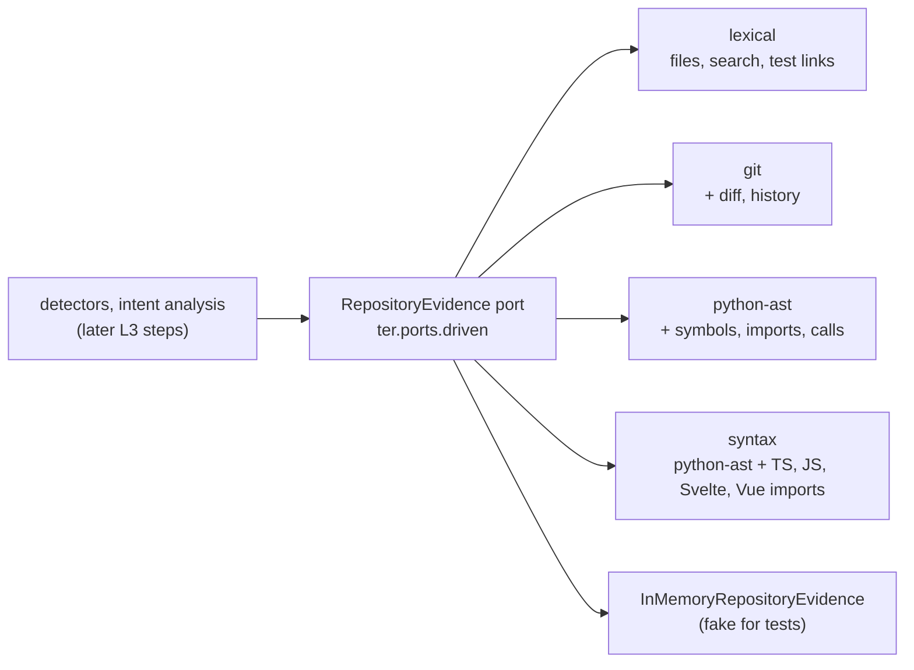

# L3 Grounded: repository evidence behind the analysis

At L3 TER stops judging a session from its event stream alone and asks the
repository what the code says: which files and symbols exist, which tests
import a module, what changed in the working tree and how each file evolved.
All of it comes through one provider-neutral driven port,
`RepositoryEvidence`, served by interchangeable engines that load as
capabilities.

This page covers what is built so far: the port and four engines (steps 1
to 3 of the L3 plan, with TypeScript, JavaScript, Svelte and Vue imports
beside Python's), and the first detectors grounded on them: each task's
expected change surface with the edits outside it, and imports that break
the repository's architecture contracts (step 4), then evidence usage,
outcome value, exploration drift and the grounded evidence graph
([below](#evidence-usage-outcome-value-drift-and-the-evidence-graph)).
Requirements for later steps stay `planned` in
`requirements/l3_grounded.yaml`.

## Requirements

| Id | Requirement | Verified by |
|---|---|---|
| TER-EVD-001 | TER shall obtain repository evidence only through the provider-neutral RepositoryEvidence port. | `tests/contract/test_repository_evidence.py`, `tests/architecture/test_repository_evidence_boundary.py`, the `provider-neutral-evidence` import contract |
| TER-EVD-002 | The lexical repository evidence adapter shall return identical results for identical repository content. | `tests/unit/test_ter4_repository_evidence.py::TestLexicalDeterminism`, `tests/golden/test_repository_evidence_snapshot.py` |
| TER-EVD-003 | When a detector requests repository evidence for a Python source module, the repository evidence adapter shall return every test module whose import statements import that source module. | contract suite, `TestTestsImporting`, `TestSharedRules` |
| TER-EVD-012 | Where the repository evidence adapter supports the language of a source file, the repository evidence adapter shall return the symbols and imports of that file read from its syntax, and the call edges of a Python file. | `TestPythonSyntax`, golden `repository/python-ast.json`; `tests/unit/test_ter4_ecmascript_evidence.py` (`TestImportForms`, `TestWhatIsNotAnImport`, `TestComponents`, `TestDefinitions`, `TestResolution`), golden `repository/syntax.json`, the contract suite's TypeScript/Svelte monorepo |
| TER-EVD-013 | Where the repository is a Git working tree, the Git repository evidence adapter shall return the current diff and the history of each file. | `TestGitWorkTree`, `TestGitDiff`, `TestGitHistory` |
| TER-ARC-007 | TER shall load repository engines through the ter.capabilities plugin registry. | `TestRepositoryEnginesArePlugins` |
| TER-EVD-006 | TER shall compute the expected change surface of each task and report every edit outside it. | `tests/unit/test_ter4_change_surface.py` (`TestChangeSurface`, `TestUnrelatedModification`, `TestSurfaceExpansion`, `TestGroundedFold`), `tests/unit/test_ter4_grounded_cli.py` |
| TER-EVD-007 | When an edit to a Python module adds an import that breaks a declared import-linter forbidden, layers or independence contract, TER shall report an architectural boundary violation. | `TestBoundaryViolation`, `TestContractRules`, `TestImportLinterReader`, `tests/contract/test_architecture_contracts.py`, the `structure_of` contract tests, `tests/unit/test_ter4_grounded_cli.py` |
| TER-EVD-014 | When a detector requests repository evidence for a TypeScript, JavaScript, Svelte or Vue source module, the repository evidence adapter shall return every test module whose imports load that source module. | `TestEcmaScriptTests`, contract `test_tests_of_another_language_are_linked_or_refused`, golden `repository/syntax.json` |
| TER-EVD-015 (planned) | Boundary violations for contracts TER-EVD-007 does not evaluate: other languages, other contract types, indirect import chains. | split from TER-EVD-007 |
| TER-EVD-016 (planned) | Call edges of TypeScript, JavaScript, Svelte and Vue files. | split from TER-EVD-012 |
| TER-EVD-017 | TER shall map a session path to a repository path when the path lies under any accepted root of the session, where the accepted roots are the directory most session paths name the repository by, each Claude Code worktree checkout under which a session path names a repository file or directory, the directory such a worktree was made from when a session path under it names a repository file or directory, and each other directory under which at least two distinct session paths name repository files with at least one of them in a subdirectory. | `tests/unit/test_ter4_session_roots.py::TestMoreThanOneCheckout` |
| TER-EVD-018 | When TER matches session paths against roots, TER shall compare Windows drive letters without regard to case and with either path separator, reading a Git-Bash path of the form /x/... as the drive path X:/... only when the session also uses drive-letter paths. | `TestPathSpelling` |
| TER-EVD-019 | If an edited path lies outside every root of the session and under a .claude directory that is not a worktree checkout, then TER shall place the edit as harness state and report no change surface finding for it. | `TestHarnessState` |
| TER-EVD-020 | While no session path names a repository file or lies in a repository directory, TER shall take as the session root the prefix most session paths agree on whose remainder lies under a repository directory at least two levels deep. | `TestNewDirectories` |

Unless named otherwise, the test classes are in
`tests/unit/test_ter4_repository_evidence.py` (engines) or
`tests/unit/test_ter4_change_surface.py` (grounded detectors). Live
analysis does not read the diff (P062), so P051 and P062 stay partial.

**Real data still needed.** TER-EVD-006 and TER-EVD-007 are verified on
synthetic sessions and synthetic repositories committed with Git. The points
they serve (P063 change surface, P064 expansion, P065 boundary violations,
P066 unrelated modifications) stay `partial` until the detectors are run on
real sessions together with the repository each session worked in, checked
out at the commit it started from (D4 in the maturity plan), and their
finding rates and false positives are recorded.

## The port



An engine is built for one repository root. Every method returns values from
`ter.domain.repository`, never vendor or IO types:

| Method | Returns | Engines without it |
|---|---|---|
| `files()` | every file, relative to the root, `/`-separated, sorted; no `.git`, `.hg` or `.svn` content, no symbolic links | all have it |
| `text(path)` | a listed file's UTF-8 text | all have it |
| `search(needle, regex=False)` | `TextMatch(path, line, text)` for every line containing `needle`, by path then line; binary and non-UTF-8 files are skipped | all have it |
| `tests_importing(path)` | the test modules whose import statements import the module at `path` | all have it for Python; `syntax` also for TypeScript, JavaScript, Svelte and Vue |
| `structure(path)` | `SourceStructure`: symbols, imports, call edges, or a parse `error` | `None` |
| `structure_of(path, text)` | what `structure(path)` would return if the file held `text`; also for a path the repository does not list (a file a session creates) | `None` |
| `diff()` | `RepositoryDiff`: the working tree against `HEAD` | `None` |
| `history(path)` | `FileCommit`s, newest first | `None` |

A path the repository does not list raises `UnknownPathError`; asking for
the tests of a file in a language the engine has no import rule for raises
`UnsupportedLanguageError`. An engine says what it cannot do by returning
`None`, never by guessing.

Every obligation is a test in `tests/contract/test_repository_evidence.py`,
run against all four engines and the in-memory fake on one synthetic
repository (`tests/contract/repository_fixture.py`), and again on a
TypeScript/Svelte monorepo (`tests/contract/ecmascript_fixture.py`): an
engine that reads a file's structure must resolve its imports to the files
the fixture names and link its tests; one that does not must refuse.

## Engines

Engines are capabilities (ADR 0005), keyed `RepositoryEvidence.<engine>`
and declared both in `ter.bootstrap.capabilities.BUILTIN_CAPABILITIES` and
as `ter.capabilities` entry points in `pyproject.toml`. Callers get one
through the registry:

```python
from ter.bootstrap.capabilities import repository_evidence

engine = repository_evidence("path/to/repo", "syntax")  # default: "lexical"
engine.tests_importing("src/pkg/core.py")
```

An installed package adds an engine by declaring a
`RepositoryEvidence.<name>` entry point whose class takes the repository
root (TER-ARC-007). A class that lacks a port method is refused with a
`CapabilityError` naming it.

### `lexical`: the deterministic baseline

Reads files under the root and answers from their text. Every answer depends
only on paths and bytes, not on where the root is, file times or directory
order, so it is the baseline richer engines are measured against (P055). The
golden snapshot `tests/golden/snapshots/repository/lexical.json` freezes its
answers on the synthetic repository.

Import statements are read by pattern: `import a.b`, `import a as b, c`,
`from a import (b, c)`, backslash continuations, and relative imports
resolved against the importing file's package. Being lexical, it also
counts an import statement written inside a string.

### `python-ast`: Python syntax trees

The lexical engine plus `structure()` for `.py` files, from the standard
library's `ast`:

- **symbols**: classes, functions and methods, qualified within the module
  (`Calc.total`, `Service.fetch.inner`), with first and last line;
- **imports**: one `ImportEdge(module, names, line)` per statement, relative
  imports resolved to absolute module names;
- **call edges**: `CallEdge(caller, callee, line, resolved)` for each call
  whose target is a dotted name, attributed to the innermost enclosing
  definition or `<module>`, with `resolved` set to the absolute name when the
  head of the callee is a name the file imports or defines at top level
  (`plus` imported from `.core` as `add` resolves to `pkg.core.add`). Calls
  on other expressions (`f()()`, `x[0]()`) have no name and are left out.

Its test-to-source links use the syntax tree, so an import inside a string
does not count; a test file that does not parse falls back to the lexical
reading. Files in other languages have no structure.

### `syntax`: Python, TypeScript, JavaScript, Svelte and Vue

The `python-ast` engine extended, file by file, to the languages of a
typical web repository (`ter.adapters.driven.repository.syntax`, reader in
`ecmascript.py`). It is the default for `--repo`. `.py` files are read
exactly as `python-ast` reads them. `.ts`, `.tsx`, `.mts`, `.cts`, `.js`,
`.jsx`, `.mjs`, `.cjs` files and the `<script>` blocks of `.svelte` and
`.vue` components (line numbers counted in the whole file; an HTML comment
cannot hide a script block, and markup is never read) give:

- **imports**: `import x, {a as b} from 'm'`, `import * as ns from 'm'`,
  `import type {T} from 'm'` (a type-only import is still a dependency: the
  importer compiles against it), `export {a} from 'm'`, `export * from 'm'`,
  side-effect `import 'm'`, `require('m')` and `import('m')` with a literal
  specifier. `ImportEdge.module` is the specifier as written and
  `ImportEdge.candidates` the repository paths it may load, in resolution
  order; `resolve_import(edge, files)` picks the first the repository (or
  the session) holds. A computed specifier (`import(name)`, a template with
  `${}`) names no file and is left out;
- **symbols**: `function` and `class` declarations (qualified within
  enclosing definitions), class methods, module-level
  `const f = (...) =>` arrow functions and, for a component whose file stem
  is a name (`CourseCard.svelte`), the component itself;
- no call edges (TER-EVD-016). The file's `module` is its own path.

The reader is a tokenizer, not a parser, and needs no third-party package:
it skips comments, string literals, template literals (but reads the code
inside `${...}`) and regular expression literals (a `/` after a value
divides, anywhere else it starts a regular expression), so `import` in a
comment, a string or a regex is never an import, and `loader.import(x)`,
`{ import: 1 }` and `import.meta` are not imports either. A quote string
ends at its line, so an apostrophe in JSX text cannot swallow the rest of
the file.

**Resolution.** Relative specifiers resolve against the importing file's
directory; then, in order: `$lib` to `src/lib` of the nearest SvelteKit
project (a directory with `svelte.config.*` or a `package.json` that
depends on `@sveltejs/kit`); the `compilerOptions.paths` of the nearest
`tsconfig.json` or `jsconfig.json` (JSON with comments and trailing commas;
`extends` followed within the repository; the longest matching pattern
wins; `paths` resolve against `baseUrl`, else the config's own directory);
a workspace package, by the `name` of any `package.json` outside
`node_modules`, to its declared entries (`exports`, `svelte`, `types`,
`module`, `main`; a `.js` entry also tries the `.ts` it compiles from) then
`src/index.*`, `src/lib/index.*` and `index.*`, and a subpath of it
(`@scope/pkg/sub`, `exports` subpath patterns) to that path in the package;
and finally `baseUrl`. Each resolved path is probed as written, with each
source suffix (`.ts`, `.tsx`, `.d.ts`, `.js`, ..., `.svelte`, `.vue`,
`.json`) and as a directory's `index.*`. Anything else (`react`,
`svelte/store`, `$app/stores`, `node:fs`) is an external package: no
candidates, no edge. Generated files that are not in the repository
(`.svelte-kit/tsconfig.json`, SvelteKit's `./$types`) resolve to nothing.

The project configuration is read once per engine, on the first ECMAScript
question, from the repository's own files; an engine serves one commit.

**Tests.** A TypeScript or JavaScript test module is `*.test.*` or
`*.spec.*`, or any such file under a `__tests__/` or `tests/` directory;
nothing under `node_modules` is a test. `tests_importing(path)` returns the
test modules with an import that resolves to `path`. Links are direct: a
test that imports `./index` is a test of the index file, not of what the
index re-exports (TER-EVD-014).

**On real repositories.** On shallow clones of two public repositories of
the kind TER's real sessions worked in (`tutors-sdk/tutors-mono-repo`, a
SvelteKit pnpm monorepo of 730 source files, and `lgriffin/ESI.ts`, 1,703),
96% and 99.6% of the imports that name a repository path resolved to a
file (1,566 of 1,626 and 4,174 of 4,189). Every miss, checked by hand,
names a file the checkout does not hold: SvelteKit's generated `./$types`,
packages whose only entry is a build output, and fixtures whose paths are
deliberately broken. The grounding
precompute takes 1.4 s and 3.1 s there (the Python-only engine on TER's own
repository: 1.9 s).

### `git`: diff and history

The lexical engine over the files Git sees (tracked files still on disk and
untracked files that are not ignored), plus:

- `diff()`: staged, unstaged and untracked changes against `HEAD` (or the
  empty tree before the first commit, with `base` `None`). Each
  `FileChange` has a status (`added`, `modified`, `deleted`, `untracked`,
  `type-changed`), added and removed line counts (`None` for binary files)
  and the unified patch.
- `history(path)`: the file's commits, newest first, following renames;
  each `FileCommit` has the commit id, ISO 8601 commit time, author name,
  subject, the file's name in that commit and its line counts there.

Only this engine runs `git`, as a subprocess, with the settings that would
make output depend on user configuration pinned (no colour, no external
diff, no rename detection in diffs, unquoted paths, the C locale, literal
pathspecs). It refuses, with `NotAWorkTreeError`, a directory that is not
the top level of a Git working tree (a plain directory, a subdirectory, a
bare repository), so "no Git" is never mistaken for "no changes". The other
engines return no diff or history without error.

## Grounded analysis: change surface and boundaries

`python -m ter explain` and `python -m ter a3` take the repository a
session worked in:

```bash
git worktree add ../shop-at-start <start-commit>   # the commit the session started from
python -m ter explain session.jsonl --repo ../shop-at-start
python -m ter a3 session.jsonl --repo ../shop-at-start --html a3.html
```

`--repo-engine` picks the engine (default `syntax`, which reads the import
graph of Python, TypeScript, JavaScript, Svelte and Vue files; `python-ast`
reads Python only; `lexical` gives the surface without import links). The
repository must be the one at the session's start commit: TER replays the
session's edits on it, so a checkout that already holds them reads as edits
that cannot be replayed. Without `--repo`, `explain` and `a3` are exactly
the L2 commands, and their output is unchanged.

### Computed once, then a fold

`ter.application.ground.ground_session` reads the repository once through
the port and returns a `RepositoryGrounding` (`ter.domain.lean.grounding`),
values only:

- the files, the Python module names and the **import graph** at the start
  commit (which repository files each file imports, and the reverse), from
  the syntax of every Python, TypeScript, JavaScript, Svelte and Vue file
  the engine reads; third-party code (`node_modules`, minified `*.min.*`
  bundles) is not read;
- the **distinctive symbols** each file defines: names a prompt can only
  mean one way, with an inner underscore or an inner capital
  (`tests_importing`, `ExplainSession`; never `run` or `main`);
- the mapping from the session's paths to repository paths, through the
  session's **roots** (`roots` in `explain --json` and in the A3's
  `background.repository`; the text output lists them when there is more
  than one). See [Session roots](#session-roots) below;
- for each edit and write, the file **after** it, replayed on the start
  commit's text (`replay_edit`: `content` replaces; `old_string` must be
  found, else the file's text is unknown from there on), parsed with
  `structure_of`, and the imports the edit **added** (a TypeScript or
  JavaScript import resolves against the start commit's files and the
  files the session created);
- the architecture contracts the repository declares, read through the
  `ArchitectureContracts` port.

The analysis is then given the grounding beside the events
(`explain(..., repository=g)`, `AnalysisEngine.explain(repository=g)`); the
grounded detectors read it like any other index, nothing in the domain does
IO, and batch still equals incremental (`TestGroundedFold`). The grounding
of the TER repository itself (1,000 files) takes under two seconds.

### The expected change surface (TER-EVD-006)

Per task (a prompt and the work up to the next one), built from structure
only, never from token counts or word scores:

1. **Seeds**: the repository files the prompt names, by file name or path
   (`pricing.py`, `src/app/domain/pricing.py`), dotted module name
   (`app.domain.pricing`) or a distinctive symbol the file defines
   (`price_with_tax`). A prompt that names none *inherits* the seeds of the
   last prompt that did when the intent record reads it as a refinement or
   an acknowledgement ("go ahead"); after a changed intent, or before any
   file was named, the seed is the task's **first edited** repository file.
2. **Neighbours**: every repository file a seed imports or is imported by,
   at the start commit or after the task's own edits (a new module a seed
   now imports is a neighbour).
3. **Tests**: every test module that imports a seed or a neighbour.

Every edit of the task is then placed, and every placement is in the
analysis (`change_surfaces` in `explain --json`, one line in the text
output):

| Placement | Meaning | Finding |
|---|---|---|
| `inside` | the file is a seed, a neighbour or a test of the surface | none |
| `expansion` | outside, but it imports or is imported by a file inside (P064) | `surface_expansion` |
| `unrelated` | outside, with no import link to any file inside (P066) | `unrelated_modification` |
| `harness_state` | outside every root and under a `.claude` directory that is not a worktree checkout: the agent's plans, memory and settings (`~/.claude/plans/x.md`) (TER-EVD-019) | none: not judged |
| `outside_repository` | not a path under any root of the session (`/tmp/x.py`) | none: not judged |

A harness-state or outside edit is never a seed, a neighbour or a finding.
A project's own `CLAUDE.md` or `.claude/settings.json` inside the root is a
repository path and placed like any other file.

### Session roots

A session's tools use absolute paths (`/home/me/shop/src/a.py`); the
repository lists paths relative to its root (`src/a.py`). Events carry no
working directory, so the roots come from the paths alone
(`session_roots` in `ter.domain.repository`):

1. **Spelling** (TER-EVD-018). Paths are compared in one spelling:
   backslashes become `/` and a drive letter is upper case (`d:\x` and
   `D:/x` are one path). A Git-Bash path `/d/x` is read as `D:/x` only when
   the session also uses drive-letter paths: on Linux or macOS `/d` is an
   ordinary directory, and a Git-Bash-only session matches its own spelling
   anyway, so the conditional rule loses nothing and never invents a drive.
   Nothing else is case-folded.
2. **Main root.** For each path, the shortest prefix whose remainder is a
   repository file is a candidate; the root is the candidate most paths
   agree on (ties: the shorter, then the first in sort order). When no path
   names a file (a session that only creates files), the same vote runs on
   paths whose directory is a repository directory, and then (TER-EVD-020)
   on paths that lie under a repository directory **at least two levels
   deep** (`src/main/java/...` for a new Java package). One level is not
   enough: a top-level name such as `src` also names directories above
   checkouts (`/home/me/src/proj`), which would make a false root.
3. **Other checkouts** (TER-EVD-017). A Claude Code worktree checkout
   `<dir>/.claude/worktrees/<name>` is a root when the remainder of a path
   under it names a repository file or directory (or lies in one); `<dir>`,
   the checkout the worktree was made from, is a root when a path under it
   (outside its `.claude`) does the same. For paths under no root yet, a
   prefix is a root when at least two distinct paths under it name
   repository files, at least one of them in a subdirectory, so a stray
   `README.md` or `package.json` elsewhere does not make a root.

A path under more than one root (a worktree inside the main checkout) maps
through the deepest. `grounding.root` is the main root, the first of
`grounding.roots`.

**Rejected: a root from the created files' common directory.** A session
whose paths name nothing the start commit holds could take the deepest
common directory of the files it created. That directory lies *inside* the
repository (`/w/p/src/newpkg`), so every path would map to the wrong
repository path; a session with no structural match keeps no root, and its
edits stay `outside_repository`.

### Boundary violations (TER-EVD-007)

`ImportLinterContracts` (`ter.adapters.driven.import_linter`, capability
`ArchitectureContracts.import-linter`) reads the contracts a repository
declares for import-linter, from `.importlinter`, `setup.cfg` or
`pyproject.toml` (this repository's own `[tool.importlinter]` is a real
example and a test fixture). It evaluates `forbidden`, `layers` (with
`containers`, independent `a | b` and non-independent `a : b` siblings) and
`independence` contracts, honouring `ignore_imports` with `*` and `**`
wildcards; other contract types are skipped, never guessed. The reader does
no IO: TER reads the file through `RepositoryEvidence`, at the start commit.
A file that cannot be read is reported (`contract_problem`, and a warning on
stderr) and no contract is checked.

An edit **adds** an import when the replayed file imports a module after the
edit that it did not import before it (`from p import m` imports the
submodule `p.m` when it is a module of the repository, otherwise `p`). Each
added import is checked against every contract for the file's module. Only
direct imports are judged; an import already there at the start commit is
never reported.

### Grounded detectors

They are plugins like the L2 detectors (`ter.domain.lean.surface`,
`GROUNDED_DETECTORS`), each with a countermeasure and a follow-up measure in
the A3, but they join the registry only when the analysis is given
repository evidence, so an L2 analysis lists exactly the L2 detectors.

| Detector | Waste | Kind | Confidence rule |
|---|---|---|---|
| `unrelated_modification` | overproduction | waste | Per task and file outside the surface and not one import link beyond it: 0.60 (uncertain) when the prompt named the seeds and the file's imports were read from its syntax (calibrated on real sessions, see below); 0.65 (uncertain) when the seeds were inherited; 0.55 (uncertain) when the file has no import evidence (a language the engine does not read, did not parse, or a `lexical` engine) or the seed is the task's first edit, or the file is a test module the task created (on a real session, a new test reached the code under test only through the CLI). |
| `surface_expansion` | overproduction | waste | Per task and file one import link beyond the surface: 0.60 (uncertain) when the prompt named the seeds, 0.50 otherwise. Always uncertain: callers often have to change with what they call. |
| `boundary_violation` | defects | risk | Per added import and broken contract: **0.90** when the import is still there after the session's last edit of the file; 0.70 when a later edit could not be replayed; 0.55 (uncertain) when a later edit removed it. |

Countermeasures: keep each task's edits inside its surface (a CLAUDE.md rule
and the list of files to revert or split off); make ripple edits a stated
decision; run `lint-imports` in a PostToolUse hook on `Edit|Write` and name
the broken contracts in CLAUDE.md.

## Shared rules

The pure rules every engine and the fake share live in
`ter.domain.repository`:

- a **test module** is `test_*.py` or `*_test.py` (pytest's default naming;
  `conftest.py` and helpers are not tests), or a TypeScript, JavaScript,
  Svelte or Vue file named `*.test.*` or `*.spec.*` or lying under
  `__tests__/` or `tests/` (`is_test_module`);
- **third-party code** is anything under `node_modules` and minified
  bundles (`*.min.js`, `*.min.mjs`): never a source or a test of the
  repository (`is_vendored`);
- an ECMAScript import **loads** the first of its candidate paths that is a
  file (`resolve_import`);
- a file's **module name** follows parent directories while they hold an
  `__init__.py`; the first directory without one is an import root (`src/`,
  `tests/`, the repository root). Namespace packages are not recognised;
- an import statement **imports** module `M` when it names `M` or a dotted
  name under it (Python imports every parent package first), and
  `from P import m` may import the submodule `P.m`. `pkg.core_extra` is not
  `pkg.core`;
- links are **direct**: a test that imports `pkg.util`, which imports
  `pkg.core`, is a test of `pkg.util` only. Imports made by calling
  `importlib` are not import statements and are never seen.

## Boundaries

- `ter.domain.repository` holds values and pure rules only; no IO.
- The `provider-neutral-evidence` import contract keeps the domain module and
  every engine free of model SDKs, tokenizers, embedders, TER 3 internals and
  external capability stacks (P054). The engines are one package in the
  `independent-adapters` contract.
- `tests/architecture/test_repository_evidence_boundary.py` checks that no
  module outside the engines imports `subprocess`, `ast` or a Git or
  tree-sitter library, so repository evidence can only come through the
  port (TER-EVD-001).

## Where the code lives

| Layer | Module |
|---|---|
| domain | `ter/domain/repository.py`: `TextMatch`, `Symbol`, `ImportEdge`, `CallEdge`, `SourceStructure`, `FileChange`, `RepositoryDiff`, `FileCommit`, errors, shared rules |
| domain | `ter/domain/repository.py` also: `ArchitectureContract`, `Layer`, `ContractViolation`, `contract_violations`, `imported_modules`, `session_roots`, `session_root`, `repository_path`, `canonical_path`, `is_harness_state` |
| domain | `ter/domain/lean/grounding.py`: `RepositoryGrounding`, `EditGrounding`, `replay_edit`; `ter/domain/lean/surface.py`: `ChangeSurface`, `change_surfaces`, the grounded detectors |
| ports | `ter/ports/driven.py`: `RepositoryEvidence`, `ArchitectureContracts` |
| driven adapters | `ter/adapters/driven/repository/`: `lexical.py`, `python_ast.py`, `git.py`, `syntax.py` with the ECMAScript reader `ecmascript.py`; `ter/adapters/driven/import_linter.py`; fakes `InMemoryRepositoryEvidence`, `InMemoryArchitectureContracts` in `ter/adapters/driven/in_memory.py` |
| application | `ter/application/ground.py`: `ground_session`; `ExplainSession(repository=, contracts=)` |
| composition | `ter/bootstrap/capabilities.py`: `repository_evidence(root, engine)`; `ter/bootstrap`: `make_contracts()`, `--repo` wiring |

## Evidence usage, outcome value, drift and the evidence graph

| Id | Requirement | Verified by |
|---|---|---|
| TER-EVD-008 | TER shall report, for each repository read, whether a later decision, edit or test used its content. | `tests/unit/test_ter4_evidence_usage.py::TestEvidenceUsage` |
| TER-GRF-001 | TER shall build an evidence graph that links the intent, observations, decisions, actions, changes and validation events of each session. | `TestEvidenceGraph` |
| TER-LEN-009 | TER shall judge the value of each exploration, reasoning and validation event against the software outcome stated in the current intent, using repository evidence of what the outcome required. | `TestOutcomeValue` |
| TER-ITN-006 | If agent exploration or reasoning departs from the current intent without a recorded intent change, and repository evidence shows it touches nothing the intended change depends on, then TER shall classify the departure as drift. | `TestExplorationDrift` |

All four need `--repo`; without it `explain` and `a3` are unchanged. They
are computed when the analysis is asked for, from the folded steps and the
`RepositoryGrounding`, so batch equals incremental
(`test_the_graph_is_deterministic_and_batch_equals_incremental`). On a real
session of about 1,300 events they add about 0.2 s.

### Evidence usage (TER-EVD-008, points 67 to 70)

`ter.domain.lean.usage`. A **repository read** is a `Read` of a repository
file, or a shell command that only reads (`ShellIntent.EXPLORE`: `cat`,
`head`, `grep`, ...; or a `sed -n` print) naming repository files by path,
relative or absolute under a session root (one read per file; the output's
tokens are shared between them). On a real session most reads were shell
commands, so leaving them out would miss most of the evidence. Each read is
searched forward for a structural use; the first use of each kind is
recorded with its event id:

| Use | Rule | Material |
|---|---|---|
| `edited` | a later edit or write changes the same file | yes |
| `imported_by_edit` | a later edit changes a file that imports the read file (start commit, or after that edit) | yes |
| `named_in_edit` | a later edit's text (not its own path) names the file | yes |
| `named_in_command` | a later shell command that neither checks nor reads names the file | yes |
| `tested` | a later check names the file or a test module that imports it | yes |
| `named_in_decision` | a later reasoning block or response names the file | no |

A file is **named** by its base name, a distinctive stem
(`fragment_store`), its dotted module name, or a distinctive symbol it
defines (from the repository's syntax, or from the read's own text), each
counted only when no other file shares it: `__init__.py`, `index.ts` or a
`run` defined twice name nothing. Reading the file again is not a use.

Status: `used` (any use), `unused` (none, and a response followed the read)
or `pending` (no response yet; a live read is not judged early). `material`
marks reads a change, a command or a check acted on (influential, P069);
unused reads carry their context tokens (P070). The summary gives the share
of judged reads that were used (P068) and the files read against the files
changed (P067). `explain --json`: `evidence_usage`; A3 JSON:
`analysis.evidence_usage`; text: one `evidence usage` line.

**Limits.** An ad-hoc script run (`python - <<EOF`) is read as a check by
the L2 shell reading, so a script that rewrites a file it names shows as
`tested`; it is a material use either way. Changes made by such scripts are
not edits, so "files changed" counts edit and write tools only.

### Outcome value (TER-LEN-009, points 6, 7)

`ter.domain.lean.value`. Per task (a prompt and the work up to the next),
what the outcome **required** is the task's change surface (seeds named by
the prompt, their import neighbours and tests) plus the files the task
edited. Every exploration request, reasoning block and check is judged
against it, with the evidence usage of its reads. Each judgement names its
rule, the files, and the evidence ids (the event and its result, the
prompt, the events that used it). Value classes:

| Class | Meaning |
|---|---|
| `required` | it touched what the outcome required and the change or its check used it |
| `supporting` | it fed the work from off the surface, or touched the surface without being used, or the task changed nothing |
| `no_value` | off the surface and nothing later used it; always uncertain |
| `unjudged` | no repository evidence either way (names no repository file, or no response yet) |

| Rule | Class | Confidence |
|---|---|---|
| `explore.surface_used` | required | 0.85 |
| `explore.off_surface_used` | supporting | 0.75 |
| `explore.surface_unused`, `explore.decision_only`, `explore.no_change_used` | supporting | 0.60 |
| `explore.unused` | no_value | 0.65 |
| `explore.no_change_unused` | no_value | 0.55 |
| `reasoning.surface_then_change` | required | 0.75 |
| `reasoning.surface_no_change`, `reasoning.off_surface_used` | supporting | 0.60 |
| `reasoning.off_surface_unused` | no_value | 0.55 |
| `validation.covers_surface` (after an edit, names a surface file or test) | required | 0.85 |
| `validation.suite_after_change` (after an edit, names no file) | required | 0.75 |
| `validation.off_surface`, `validation.baseline` | supporting | 0.60 |
| `validation.no_new_change` (no edit since the task's previous check) | no_value | 0.55 |
| `validation.no_change` | supporting | 0.55 |
| `*.no_evidence` | unjudged | 0 |

Below 0.70 a judgement is uncertain. Searches and other exploration are
judged by the files their request or output names that a later read or
edit touched. The judgements are a view for the reader: they do not change
activity classes or the scorecard. `explain --json`: `outcome_value` (with
`rules`); A3 JSON: `analysis.outcome_value`; text: one `outcome value` line.

### Exploration drift (TER-ITN-006, point 48)

A grounded detector, `exploration_drift` (`ter.domain.lean.drift`, waste
*motion*), with a countermeasure (keep exploration on what the change
depends on) and a follow-up measure. It joins the registry with the other
grounded detectors only when the analysis has repository evidence
(`EVIDENCE_DETECTORS`), so an L2 analysis lists exactly the L2 detectors.

Within a task that changed something, a read (tool or shell) or a reasoning
block naming repository files is a departure when its intent alignment is
not in the aligned band and **every** file it touches is independent of the
change. A file is **dependent** when it is on the surface, edited by the
task, one import link from the surface, used later by a change, command or
check, or a **test, doc, CI or config file** (`file_role`). The last rule
is the calibration lesson above: import-graph evidence alone gave 0 true
positives in 29 judged `unrelated_modification` findings, because tasks
need tests, docs, CI, config and modules an issue names. A new prompt (a
recorded intent change) starts a new task and surface, so following it is
never drift.

| Case | Confidence |
|---|---|
| read, prompt named the seeds, source file in a different top-level package (`src/app`, `scripts`, `packages/web`) from every seed and edited file, nothing later named it | **0.75** |
| read in the same top-level package, or named later by a decision | 0.60 (uncertain) |
| surface inherited from an earlier prompt | 0.60 (uncertain) |
| surface grown from the task's first edit (the prompt named no file) | 0.50 (uncertain) |
| reasoning naming only independent files | 0.50 (uncertain) |

No finding before a response follows (live), or in a task that changed
nothing. **Real data still needed**: the confident case is a rule, not a
calibration; P048 stays partial until findings on judged real sessions
(D4) show true positives, as `unrelated_modification` was checked.

### The grounded evidence graph (TER-GRF-001, points 71, 72, 77)

`ter.domain.lean.evidence_graph`, schema `ter.evidence-graph/1`. Nodes are
events with a role: `intent` (prompt), `observation` (tool result),
`agent_decision` (reasoning, planning call), `action` (other tool requests),
`change` (edit, write), `validation` (a check) and `response`. Edges point
from the later event to the one it rests on, each type drawn by one rule:

| Edge | Rule |
|---|---|
| `observes` | observation -> the request whose result it is |
| `pursues` | every decision, action, change, validation and response -> the prompt in force |
| `based_on` | decision -> every observation since the previous decision or prompt |
| `decided_by` | action, change or validation -> the latest decision since the prompt |
| `motivated_by` | action, change, validation or response -> the latest observation since the prompt |
| `uses` | a later event -> the read whose content it used (evidence usage) |
| `validates` | validation -> every change since the previous validation |
| `corrects` | change -> the latest failed check result not yet followed by a pass |

Every decision has at least one evidence edge (`pursues`, and `based_on`
when it saw observations: P072). `reconstruct(event)` follows the edges
back and returns the events a change rests on, in session order (P077; no
command prints it yet). Nodes are in session order and edges sorted, so the
JSON is deterministic. `explain --json`: `grounded_evidence_graph` (with the
rules and counts per role and edge type); A3 JSON: `analysis.evidence_graph`.
The L2 graph (`evidence_graph`, `ter.evidence/0.1`) is unchanged.

## Known limits

- Test-to-source links and import graphs cover Python, TypeScript,
  JavaScript, Svelte and Vue; other languages have no structure.
- Call edges are Python only (TER-EVD-016); they name what is called, are
  not resolved to a definition in another file, and method calls through
  `self` stay unresolved.
- TypeScript and JavaScript are read by a tokenizer: a `{` in a function's
  return type (`): { a: string } {`) ends the symbol early, and Vite or
  bundler aliases other than `$lib` and `tsconfig` paths are not read.
- Architecture contracts are checked for Python modules only (TER-EVD-015).
- Symbol references other than calls are not yet navigable (P057).
- The engines read the repository on every call; nothing is cached, which
  keeps answers current. Checking that a path is listed costs no walk in the
  lexical and syntax-tree engines (each path component is checked
  directly), but `files()`, `search()` and `tests_importing()` walk the
  tree, and the Git engine asks `git` each time.
- Under the `syntax` engine the change surface reads Python, TypeScript,
  JavaScript, Svelte and Vue imports; any other file (CSS, Markdown, JSON)
  is inside it only when the prompt names it, so its findings are uncertain.

## Checking the grounded detectors on real sessions

`scripts/corpus_grounded.py` runs `explain --repo` over real sessions at the
commit each one started from. It takes a labels file with `session_id`, `repo`,
`cwd` and `commit` columns, exports each repository at that commit with
`git archive` (the repository itself is only read), and writes two files:
counts per repository (placements and grounded findings, safe to share) and a
review CSV with one row per grounded finding (edited path and the task's seed
files, kept on the owner's machine) with an empty `verdict` column to mark
`true` or `false`.

```bash
python scripts/corpus_grounded.py labels-d4.csv ~/.claude/projects \
    --work ~/ter-data/grounded --out grounded.json --review review.csv
```

The counts file (`ter.corpus-grounded/2`) also says, per repository, how
many sessions named it by 0, 1 or 2+ roots (`roots`) and why each
`outside_repository` edit was outside (`outside_reasons`, content-free): a
worktree checkout that was not accepted, a relative path, no session root
(and whether the path lay under the session's working directory), a letter
case difference, a path under the working directory but not under a root,
and, for a path outside the working directory, a Git-Bash drive spelling,
another checkout of the repository (some suffix of the path is a repository
file), a temporary directory (`/tmp/`, `/Temp/`, `AppData/Local/Temp`) or
elsewhere. Harness state has its own placement and is counted under
`placements`.

On the owner's 52 sessions (before TER-EVD-017 to TER-EVD-020), 244 edits
were outside the repository: 86 outside the working directory, 107 with no
session root (26 of them under the working directory), 12 in worktree
checkouts and 39 harness state.

### Calibration: `unrelated_modification` (9 Oct 2026)

With the `syntax` engine and the session-root rules, the owner's 52 sessions
gave 9 confident `unrelated_modification` findings (all in one TypeScript
repository) and 339 uncertain ones. The owner judged all 9 confident findings
and 20 uncertain ones sampled with seed 7, from each session's prompts and
the narration before the edit. **None of the 29 was truly unrelated.** The
edits were tests and fixtures for the task (8), CI workflows and config the
feature needed (6), docs for the change (5), source or scripts the task
required but the prompt did not name, such as modules of the issues it
referred to (7), a test helper needed to pass lint (2), a hook the user asked
to unify (1) and a licence for a new project (1).

The import graph cannot see those links, so the confident case dropped from
0.80 to 0.60: every `unrelated_modification` finding is now uncertain, a
pointer for review that is never counted as waste. Raising it again needs a
judged corpus with true positives, and evidence beyond imports (the issue a
prompt names, files the session read before editing, file roles such as
test, doc, CI and config).

## Session languages and stack

Leigh asked for "a correlation between token usage and delivery mechanism":
does a TypeScript/Svelte session spend tokens differently from a Python one?
Every analysis now records the session's *profile* (no flag needed), and
`scripts/corpus_by_stack.py` compares sessions by it
([l6-stack-comparison.md](l6-stack-comparison.md)).

| Id | Requirement | Verified by |
|---|---|---|
| TER-STK-001 | TER shall record, for each session, the languages of the files the session reads and edits, named from a documented table of file extensions and file names, with each language's read and edit counts, the request events they were counted from, and the session's dominant language. | `tests/unit/test_ter4_stack.py::TestLanguages`, `test_explain_and_a3_carry_the_profile_with_and_without_a_repository`, `test_the_cli_prints_languages_and_the_json_lists_them` |
| TER-STK-002 | Where repository evidence is given for a session, TER shall record the ecosystems, frameworks, build tools, package managers and workspaces that the repository's manifests declare, each fact citing the manifest paths that declare it. | `tests/unit/test_ter4_stack.py::TestManifests`, `test_explain_and_a3_carry_the_profile_with_and_without_a_repository` |

### Languages (no repository needed)

Every `fs.read`, `fs.edit` and `fs.write` request names a path; its language
comes from `ter.domain.stack.LANGUAGE_BY_EXTENSION` (lower-cased extension)
or `LANGUAGE_BY_FILENAME` (`Dockerfile`, `Makefile`, `Gemfile`, ...). The
table, abridged:

| Language | Extensions |
|---|---|
| TypeScript | `.ts` `.tsx` `.mts` `.cts` |
| JavaScript | `.js` `.jsx` `.mjs` `.cjs` |
| Svelte, Vue, Astro | `.svelte`, `.vue`, `.astro` |
| Python | `.py` `.pyi` `.pyx` (`.ipynb` is Jupyter Notebook) |
| Go, Rust, Java, Kotlin | `.go`, `.rs`, `.java`, `.kt` `.kts` |
| C, C++, C#, Swift, Ruby, PHP, ... | `.c` `.h`, `.cpp` `.cc` `.hpp` ..., `.cs`, `.swift`, `.rb`, `.php` |
| Shell, SQL, HCL | `.sh` `.bash` `.zsh`, `.sql`, `.tf` |
| Markup, styling, data, prose | `.html`, `.css` `.scss` `.less`, `.json` `.yaml` `.toml` `.xml`, `.md` `.mdx` `.rst` `.txt` |

Per language the profile keeps edit and read requests, distinct files
edited and read, and the request event ids it counted (results are never
counted twice). Extensions the table does not know are counted apart
(`unrecognised_extensions`) and never pick the dominant language.

The **dominant language** is decided in tiers: the programming language with
the most edits; else the markup/data/prose language with the most edits
(a docs-only session is a Markdown session); else, for a session that edits
nothing, the programming language read most; else the non-code language
read most. Ties go to more reads (or edits), then to the name. The profile is
a summary of the folded steps, so live and batch analysis agree.

### Stack (with `--repo`)

With repository evidence, `ter.application.stack.read_stack` lists the
repository's manifests through the `RepositoryEvidence` port (at most 200,
shallowest first; more are flagged `truncated`), reads each one's text, and
the pure parsers in `ter.domain.stack` turn it into facts:

| Manifest | Facts |
|---|---|
| `package.json` | ecosystem `node`; frameworks from dependencies (`svelte`, `@sveltejs/kit` → `sveltekit`, `react`, `next`, `vue`, `nuxt`, `@angular/core`, `solid-js`, `astro`, `express`, `fastify`, `@nestjs/core`, `electron`, ...); build tools (`vite`, `webpack`, `turbo`, `nx`); `typescript`; `packageManager`; `workspaces` (`npm`/`yarn`/`bun workspaces`, or `package.json workspaces` when no manager is declared) |
| `pnpm-workspace.yaml` | `pnpm`, `pnpm workspaces` when it lists packages |
| lock files | `pnpm-lock.yaml`, `yarn.lock`, `package-lock.json`, `bun.lock(b)`, `poetry.lock`, `uv.lock`, `Pipfile`, `Cargo.lock`, `go.sum` → package manager |
| `pyproject.toml` | ecosystem `python`; build backend (`hatch`, `poetry`, `setuptools`, `flit`, `pdm`, `maturin`, `uv`); `[tool.poetry]`, `[tool.uv]`, `uv workspace`; frameworks from dependencies (`django`, `flask`, `fastapi`, `starlette`, `streamlit`, `torch` → `pytorch`, `numpy`, `pandas`, ...) |
| `requirements*.txt` | ecosystem `python`; frameworks as above |
| `go.mod`, `go.work` | ecosystem `go`; `gin`, `echo`, `fiber`, `chi`, `gorilla-mux`, `grpc`, `cobra`; `go workspace` |
| `Cargo.toml` | ecosystem `rust`; `cargo workspace`; `tokio`, `axum`, `actix-web`, `rocket`, `warp`, `bevy`, `tauri`, `leptos` |
| `pom.xml`, `build.gradle(.kts)`, `settings.gradle(.kts)` | ecosystem `jvm`; `maven` / `gradle`; `spring-boot`, `quarkus`, `micronaut`, `android`, `kotlin`; `maven multi-module`, `gradle multi-project` |
| `turbo.json`, `nx.json`, `lerna.json`, `tsconfig.json`, `setup.py`, `setup.cfg` | the tool they name |

Manifests under `node_modules`, `vendor`, `.venv`, `dist`, `build`, `target`,
`.svelte-kit`, `.next` and similar directories describe dependencies or build
output, not the repository, and are skipped. A manifest that does not parse
still declares its ecosystem. Facts from several manifests (a monorepo with
many `package.json`) merge into one fact per kind and name that cites every
manifest declaring it. The stack *label* used to group sessions is the
frameworks joined by `+` (`svelte+sveltekit`), else the ecosystems, `none`
when the manifests declare neither, and `unknown` without repository
evidence.

### Where it shows

- `explain --json` and the lean JSON: `profile` (languages with evidence,
  `dominant_language`, `dominant_basis`, `unrecognised_extensions`, `stack`
  with facts, manifests and label, or `null` without `--repo`);
- the A3 JSON: `background.profile`;
- `explain` and `a3` text: a `languages` line and, with `--repo`, a `stack`
  line.

Code: `ter/domain/stack.py` (tables, `languages_of`, manifest parsers,
`merge_facts`, `stack_label`), `ter/domain/lean/analysis.py`
(`session_profile`, `LeanAnalysis.profile`), `ter/application/stack.py`
(`read_stack`), joined in `ExplainSession` after the fold.

**Limits.** Languages follow file names, not content: a `.h` file is C even
in a C++ project, and generated files count like hand-written ones. Stack
facts are what the manifests *declare*, not what the session touched; in a
monorepo the label covers every package, not the one the session edited.
