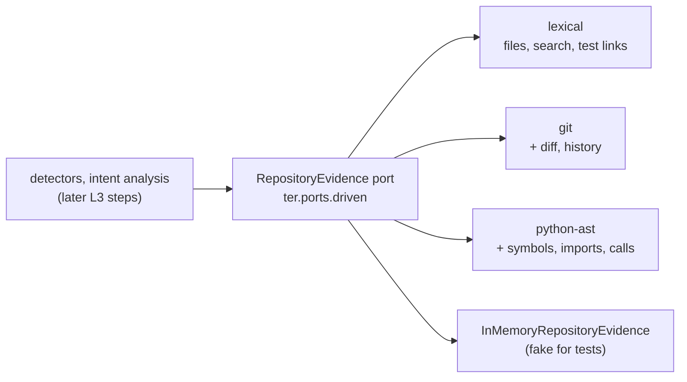

# L3 Grounded: repository evidence behind the analysis

At L3 TER stops judging a session from its event stream alone and asks the
repository what the code says: which files and symbols exist, which tests
import a module, what changed in the working tree and how each file evolved.
All of it comes through one provider-neutral driven port,
`RepositoryEvidence`, served by interchangeable engines that load as
capabilities.

This page covers what is built so far: the port and three engines (steps 1
to 3 of the L3 plan). The detectors that use the evidence (change surface,
evidence usage, context bundles) and model routing come in later steps, and
the requirements for them stay `planned` in `requirements/l3_grounded.yaml`.

## Requirements

| Id | Requirement | Verified by |
|---|---|---|
| TER-EVD-001 | TER shall obtain repository evidence only through the provider-neutral RepositoryEvidence port. | `tests/contract/test_repository_evidence.py`, `tests/architecture/test_repository_evidence_boundary.py`, the `provider-neutral-evidence` import contract |
| TER-EVD-002 | The lexical repository evidence adapter shall return identical results for identical repository content. | `tests/unit/test_ter4_repository_evidence.py::TestLexicalDeterminism`, `tests/golden/test_repository_evidence_snapshot.py` |
| TER-EVD-003 | When a detector requests repository evidence for a Python source module, the repository evidence adapter shall return every test module whose import statements import that source module. | contract suite, `TestTestsImporting`, `TestSharedRules` |
| TER-EVD-012 | Where the repository evidence adapter supports the language of a source file, the repository evidence adapter shall return the symbols, imports and call edges of that file from its syntax tree. | `TestPythonSyntax`, golden `repository/python-ast.json` |
| TER-EVD-013 | Where the repository is a Git working tree, the Git repository evidence adapter shall return the current diff and the history of each file. | `TestGitWorkTree`, `TestGitDiff`, `TestGitHistory` |
| TER-ARC-007 | TER shall load repository engines through the ter.capabilities plugin registry. | `TestRepositoryEnginesArePlugins` |
| TER-EVD-014 (planned) | Test-to-source links for languages other than Python. | split from TER-EVD-003 |

Unless named otherwise, the test classes are in
`tests/unit/test_ter4_repository_evidence.py`. The evidence is not yet wired
into any detector or into intent analysis, so the points those uses serve
(P051, P052, P062) stay partial.

## The port



An engine is built for one repository root. Every method returns values from
`ter.domain.repository`, never vendor or IO types:

| Method | Returns | Engines without it |
|---|---|---|
| `files()` | every file, relative to the root, `/`-separated, sorted; no `.git`, `.hg` or `.svn` content, no symbolic links | all have it |
| `text(path)` | a listed file's UTF-8 text | all have it |
| `search(needle, regex=False)` | `TextMatch(path, line, text)` for every line containing `needle`, by path then line; binary and non-UTF-8 files are skipped | all have it |
| `tests_importing(path)` | the test modules whose import statements import the Python module at `path` | all have it (Python only) |
| `structure(path)` | `SourceStructure`: symbols, imports, call edges, or a parse `error` | `None` |
| `diff()` | `RepositoryDiff`: the working tree against `HEAD` | `None` |
| `history(path)` | `FileCommit`s, newest first | `None` |

A path the repository does not list raises `UnknownPathError`; asking for
the tests of a non-Python file raises `UnsupportedLanguageError`. An engine
says what it cannot do by returning `None`, never by guessing.

Every obligation is a test in `tests/contract/test_repository_evidence.py`,
run against all three engines and the in-memory fake on one synthetic
repository (`tests/contract/repository_fixture.py`).

## Engines

Engines are capabilities (ADR 0005), keyed `RepositoryEvidence.<engine>`
and declared both in `ter.bootstrap.capabilities.BUILTIN_CAPABILITIES` and
as `ter.capabilities` entry points in `pyproject.toml`. Callers get one
through the registry:

```python
from ter.bootstrap.capabilities import repository_evidence

engine = repository_evidence("path/to/repo", "python-ast")  # default: "lexical"
engine.tests_importing("src/pkg/core.py")
```

An installed package adds an engine by declaring a
`RepositoryEvidence.<name>` entry point whose class takes the repository
root (TER-ARC-007). A class that lacks a port method is refused with a
`CapabilityError` naming it.

### `lexical`: the deterministic baseline

Reads files under the root and answers from their text. Every answer depends
only on paths and bytes, not on where the root is, file times or directory
order, so it is the baseline richer engines are measured against (P055). The
golden snapshot `tests/golden/snapshots/repository/lexical.json` freezes its
answers on the synthetic repository.

Import statements are read by pattern: `import a.b`, `import a as b, c`,
`from a import (b, c)`, backslash continuations, and relative imports
resolved against the importing file's package. Being lexical, it also
counts an import statement written inside a string.

### `python-ast`: Python syntax trees

The lexical engine plus `structure()` for `.py` files, from the standard
library's `ast`:

- **symbols**: classes, functions and methods, qualified within the module
  (`Calc.total`, `Service.fetch.inner`), with first and last line;
- **imports**: one `ImportEdge(module, names, line)` per statement, relative
  imports resolved to absolute module names;
- **call edges**: `CallEdge(caller, callee, line, resolved)` for each call
  whose target is a dotted name, attributed to the innermost enclosing
  definition or `<module>`, with `resolved` set to the absolute name when the
  head of the callee is a name the file imports or defines at top level
  (`plus` imported from `.core` as `add` resolves to `pkg.core.add`). Calls
  on other expressions (`f()()`, `x[0]()`) have no name and are left out.

Its test-to-source links use the syntax tree, so an import inside a string
does not count; a test file that does not parse falls back to the lexical
reading. Files in other languages have no structure.

### `git`: diff and history

The lexical engine over the files Git sees (tracked files still on disk and
untracked files that are not ignored), plus:

- `diff()`: staged, unstaged and untracked changes against `HEAD` (or the
  empty tree before the first commit, with `base` `None`). Each
  `FileChange` has a status (`added`, `modified`, `deleted`, `untracked`,
  `type-changed`), added and removed line counts (`None` for binary files)
  and the unified patch.
- `history(path)`: the file's commits, newest first, following renames;
  each `FileCommit` has the commit id, ISO 8601 commit time, author name,
  subject, the file's name in that commit and its line counts there.

Only this engine runs `git`, as a subprocess, with the settings that would
make output depend on user configuration pinned (no colour, no external
diff, no rename detection in diffs, unquoted paths, the C locale, literal
pathspecs). It refuses, with `NotAWorkTreeError`, a directory that is not
the top level of a Git working tree (a plain directory, a subdirectory, a
bare repository), so "no Git" is never mistaken for "no changes". The other
engines return no diff or history without error.

## Shared rules

The pure rules every engine and the fake share live in
`ter.domain.repository`:

- a **test module** is `test_*.py` or `*_test.py` (pytest's default naming;
  `conftest.py` and helpers are not tests);
- a file's **module name** follows parent directories while they hold an
  `__init__.py`; the first directory without one is an import root (`src/`,
  `tests/`, the repository root). Namespace packages are not recognised;
- an import statement **imports** module `M` when it names `M` or a dotted
  name under it (Python imports every parent package first), and
  `from P import m` may import the submodule `P.m`. `pkg.core_extra` is not
  `pkg.core`;
- links are **direct**: a test that imports `pkg.util`, which imports
  `pkg.core`, is a test of `pkg.util` only. Imports made by calling
  `importlib` are not import statements and are never seen.

## Boundaries

- `ter.domain.repository` holds values and pure rules only; no IO.
- The `provider-neutral-evidence` import contract keeps the domain module and
  every engine free of model SDKs, tokenizers, embedders, TER 3 internals and
  external capability stacks (P054). The engines are one package in the
  `independent-adapters` contract.
- `tests/architecture/test_repository_evidence_boundary.py` checks that no
  module outside the engines imports `subprocess`, `ast` or a Git or
  tree-sitter library, so repository evidence can only come through the
  port (TER-EVD-001).

## Where the code lives

| Layer | Module |
|---|---|
| domain | `ter/domain/repository.py`: `TextMatch`, `Symbol`, `ImportEdge`, `CallEdge`, `SourceStructure`, `FileChange`, `RepositoryDiff`, `FileCommit`, errors, shared rules |
| ports | `ter/ports/driven.py`: `RepositoryEvidence` |
| driven adapters | `ter/adapters/driven/repository/`: `lexical.py`, `python_ast.py`, `git.py`; fake `InMemoryRepositoryEvidence` in `ter/adapters/driven/in_memory.py` |
| composition | `ter/bootstrap/capabilities.py`: `repository_evidence(root, engine)` |

## Known limits

- Test-to-source links and syntax trees are Python only (TER-EVD-014 is the
  next language).
- Call edges name what is called; they are not resolved to a definition in
  another file, and method calls through `self` stay unresolved.
- Symbol references other than calls are not yet navigable (P057).
- The engines read the repository on every call; nothing is cached, which
  keeps answers current but costs a full walk on large repositories.
