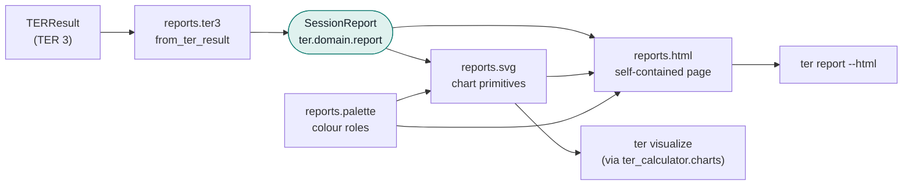
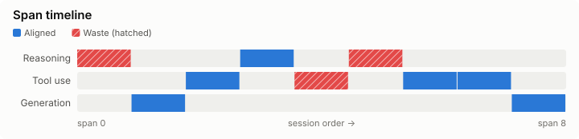
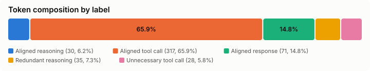
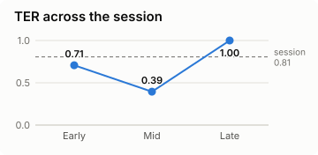

# TER 4 visual reports

TER 4 draws its charts and its HTML report in a driving-side presentation
adapter, `ter.adapters.driving.reports`. Renderers read a format-neutral
view-model, `ter.domain.report.SessionReport`, never TER 3's `TERResult`, so
the same charts will serve the L2 Lean detectors and A3 sheets when they
arrive.



| Module | Holds | May import |
|---|---|---|
| `ter.domain.report` | Frozen dataclasses: `SessionReport`, `KeyMetrics`, `LabelTokens`, `PhaseScore`, `SpanCell`, `WasteEntry`, `PositionalTer`, `EconomicsSummary`, `UncertaintySummary`, `ReportSection` | stdlib |
| `reports.ter3` | `from_ter_result(result) -> SessionReport` | domain, `ter_calculator.models` |
| `reports.palette` | Every colour, as a role with light and dark values | nothing |
| `reports.svg` | Chart primitives and report charts | domain, palette |
| `reports.html` | `render_report_html(report) -> str` | domain, palette, svg |

The `report-renderers` import contract keeps `palette`, `svg` and `html` free
of TER 3 types; only the mapper reads `TERResult`.

## Producing a report

```bash
ter report session.jsonl --html report.html             # HTML only
ter report session.jsonl --html report.html -o report.md # HTML and Markdown
ter report --latest ~/.claude/projects/my-project --html latest.html
```

`ter visualize` still writes one `.svg` per chart and `ter present` still
builds a Marp deck; both now draw through the same primitives.

## What the HTML report contains

One file with no scripts and no network requests (its Content-Security-Policy
is `default-src 'none'`), so it can be attached to a ticket or opened offline.

- **Header KPIs**: TER with its interval, aligned and waste tokens, estimated
  cost and waste cost, number of waste patterns, reliability.
- **Token composition**: a 100% bar of scored tokens by label, aligned labels
  first, with a legend giving tokens and share.
- **Span timeline**: one cell per classified span, in session order, in the
  lane of its phase. Aligned cells are blue; waste cells are red and hatched.
- **TER by phase**: horizontal bars on a fixed 0 to 1 scale.
- **TER across the session**: early, middle and late thirds as a three-point
  line, with the session TER as a dashed reference.
- **Waste Pareto**: pattern types sorted by tokens, with the cumulative share
  as a line. Bars and line share one percentage axis, so there is no second
  scale.
- **Provider token volume**: input, output and cache tokens as a 100% bar.
- **Waste-pattern table**, an **uncertainty** note in plain language, any
  extra `ReportSection`s (reserved for A3 content), and a **how to read this**
  footer.

The page follows `prefers-color-scheme` (and a `data-theme` attribute on
`<html>` for hosts that toggle themes), collapses to one column below 760px
(wide charts scroll inside their card rather than shrinking text), and prints
in light colours with cards kept whole.

## Example

Charts for `sample_sessions/example_session.jsonl`, rendered with the golden
tests' pinned tokenizer and embedder:







## Accessibility and safety rules

- Colours are the validated categorical order from `ter visualize`. Adjacent
  slots stay distinguishable under common colour-vision deficiencies. Aligned
  is blue and waste is red, the two poles of the diverging pair, and waste
  cells also carry a hatch so colour is never the only cue.
- Colours are defined once, in `reports/palette.py`. Each mark carries a hex
  fill, so a standalone `.svg` renders correctly, plus a role class that the
  HTML stylesheet maps to light or dark values.
- Every `<svg>` has `role="img"`, a `<title>` and a `<desc>` linked through
  `aria-labelledby`, and a per-mark `<title>` tooltip.
- Every session-derived string (session id, labels, pattern types and
  descriptions, section text) is escaped, and code points that XML forbids
  are dropped, so a hostile transcript cannot inject markup or break an SVG.

## Tests

| Test | Checks |
|---|---|
| `tests/golden/test_report_snapshots.py` | View-model (`<name>.report.json`), HTML (`report/<name>.html`) and sample SVGs (`report/example_session/*.svg`) for the golden corpus; regenerate with `TER_UPDATE_GOLDEN=1` |
| `tests/unit/test_ter4_reports.py` | Mapper, palette, well-formed XML for every SVG, `role`/`title`/`desc`, no external URLs, escaping of `<script>` and `-->`, `ter report --html` |

The tests verify `TER-RPT-001` (view-model) and `TER-RPT-002` (self-contained
HTML showing the TER interval and low-confidence tokens), both in
`requirements/l2_explained.yaml`; they advance points P085 and P086.

To refresh the example images after a deliberate renderer change, regenerate
the golden snapshots and copy `span_timeline.svg`, `composition.svg` and
`positional_ter.svg` from `tests/golden/snapshots/report/example_session/`.
