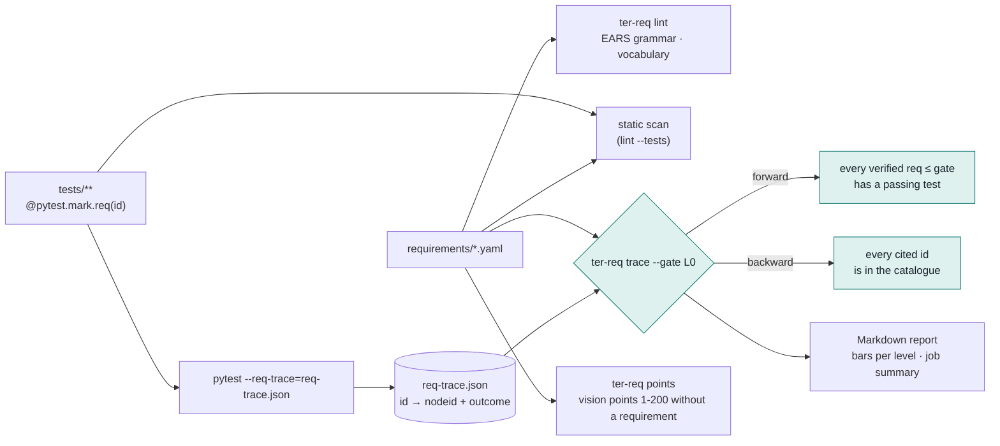

# TER 4 requirements control

Every TER 4 behaviour is a requirement written in EARS (Easy Approach to
Requirements Syntax), stored as YAML, traced to the tests that verify it and
gated in CI. A maturity level is claimed only when every requirement at that
level is verified by a passing test.

## The catalogue

`requirements/` holds one file per maturity level (`l0_measured.yaml` to
`l6_learning.yaml`). A file's top-level `level` must match the level of every
entry in it.

```yaml
level: L1
requirements:
  - id: TER-OBS-004              # TER-<AREA>-NNN, unique
    pattern: unwanted            # ubiquitous | event-driven | state-driven | unwanted | optional | complex
    text: >-
      If the event store receives an event whose id it already holds, then the
      event store shall discard the duplicate without changing stored state.
    level: L1                    # L0..L6
    port: EventStore             # optional: the port the behaviour belongs to
    source_points: []            # items (1-200) of the TER 4 vision list this realises
    rationale: Hooks can fire twice; idempotent ingestion keeps counts exact.
    status: planned              # planned | verified
```

A requirement starts as `planned`. It becomes `verified` in the same change
that adds a passing test citing it. The gate enforces only `verified`
requirements, so planned ones document the road ahead without failing CI.

Areas in use: `ANL` analysis, `SRC` session sources, `OBS` observation,
`EVD` evidence, `EXP` explanation, `INT` interventions, `RTE` routing,
`ARC` architecture, `REQ` this control itself.

## Controls



### 1. Grammar lint (`ter-req lint`)

`ter.domain.requirements` parses each text against the six EARS templates:

| Pattern | Template |
|---|---|
| ubiquitous | `The <system> shall <response>.` |
| event-driven | `When <trigger>, the <system> shall <response>.` |
| state-driven | `While <state>, the <system> shall <response>.` |
| unwanted | `If <condition>, then the <system> shall <response>.` |
| optional | `Where <feature>, the <system> shall <response>.` |
| complex | two or more clauses in the order Where, While, When or If |

It also checks that:

- the text has exactly one `shall`, starts with a capital letter and ends with a full stop;
- the declared `pattern` matches the pattern the text reads as;
- `then` appears after an If clause and nowhere else, and each clause is followed by a comma;
- the system name is at most six words (a longer one usually means a missing comma);
- no weak modal or unbounded word is used: should, may, might, could, must, fast, quickly, appropriate, efficient, user-friendly, easy, robust, optimal, and/or, TBD and similar. Say "within 50 ms at the 95th percentile", not "quickly".

Catalogue checks reject duplicate ids, malformed ids, levels outside L0-L6,
unknown fields and `source_points` outside 1-200.

**Controlled vocabulary (optional).** `requirements/vocabulary.yaml` maps
discouraged terms to preferred ones (`transcript: session`). The lint reports
each use, so the catalogue keeps one word for one concept.

`ter-req lint --tests tests` also scans the test tree for
`mark.req("...")` and fails on any id that is not in the catalogue.

### 2. Forward and backward trace (`ter-req trace`)

The root `conftest.py` registers `ter.adapters.driving.pytest_req`. With
`pytest --req-trace=req-trace.json`, it records every test that carries a
`req` marker and its outcome (`passed`, `failed`, `skipped`, `xfailed`,
`xpassed`, or `not-run` when deselected). A marker can cite several ids:
`@pytest.mark.req("TER-SRC-004", "TER-ANL-001")`.

`ter-req trace --results req-trace.json --gate L0` then fails when:

- **forward**: a `verified` requirement at or below the gate level has no
  passing citing test;
- **backward**: a test cites an id that is not in the catalogue.

It also lists planned requirements that already have a passing test, ready
to promote. `--summary PATH` appends the Markdown report; CI points it at
`$GITHUB_STEP_SUMMARY`.

### 3. Point trace (`ter-req points`)

Each requirement names the items of the 200-point TER 4 vision list it
realises. `ter-req points` draws a 10 × 20 grid (■ covered, · not yet) and
lists the uncovered points. It is informational and never fails.

### 4. Maturity gate and report (`ter-req report`)

`ter-req report --results req-trace.json [--out coverage.md]` writes a
Markdown report with one row per level:

```text
| Level            | Coverage                    | Traced | Verified | Planned |
| L0 Measured      | ████████████████████ 100%   | 10/10  | 10       | 0       |
| L1 Observed      | ░░░░░░░░░░░░░░░░░░░░ 0%     | 0/3    | 0        | 3       |
```

`█` verified and traced, `▓` verified with no passing test, `░` planned. A
Mermaid pie chart of the status split, the vision-point grid and a table of
every requirement per level follow.

CI runs the gate at L0. Raising the gate (`--gate L1`) is the build side of
claiming a level; `Maturity.permits` is the runtime side.

## Where the code lives

| Module | Role |
|---|---|
| `ter.domain.requirements` | `Requirement`, `EarsPattern`, grammar lint, forward/backward/point trace. Pure, no IO. |
| `ter.adapters.driven.requirements_yaml` | Loads the YAML catalogue and vocabulary. |
| `ter.adapters.driving.pytest_req` | Pytest plugin behind `--req-trace`. |
| `ter.adapters.driving.req_cli` | The `ter-req` command (also `python -m ter.adapters.driving.req_cli`). |
| `ter.adapters.driving.req_report` | Markdown rendering: bars, grid, Mermaid. |

The import-linter contracts forbid `yaml` and `pytest` in the domain, ports
and use cases, and keep `requirements_yaml` independent of the other driven
adapters.

## Adding a requirement

1. Add it to the file for its level with `status: planned`.
2. Run `ter-req lint`.
3. Write the test, tag it `@pytest.mark.req("<id>")`, make it pass.
4. Set `status: verified` in the same change. From then on, CI fails if that
   test stops passing or loses its tag.
