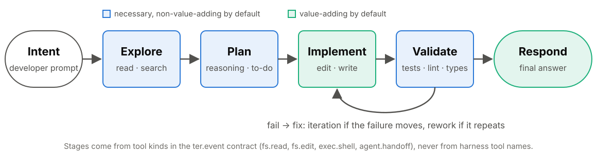
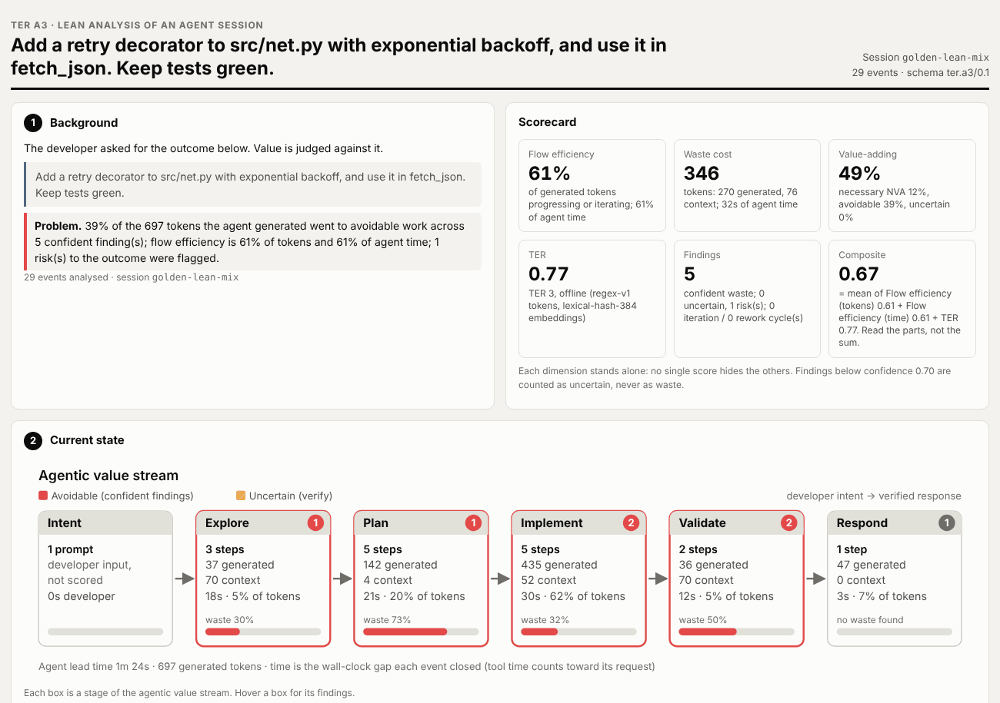
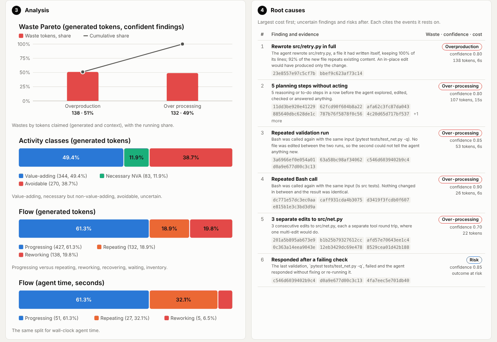
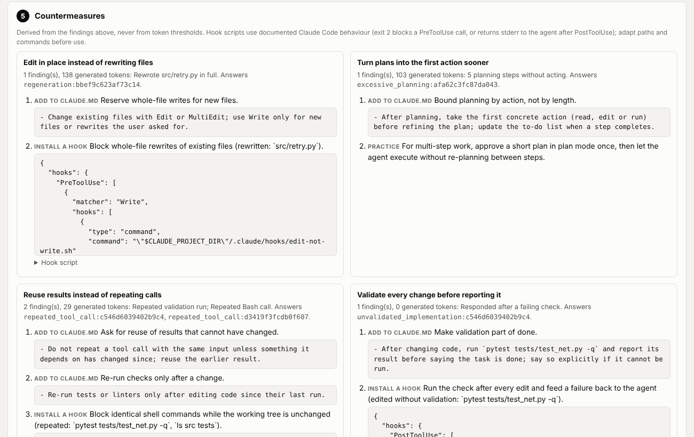
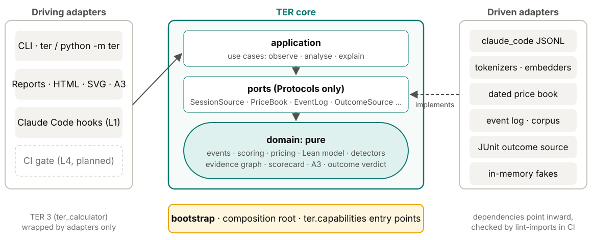
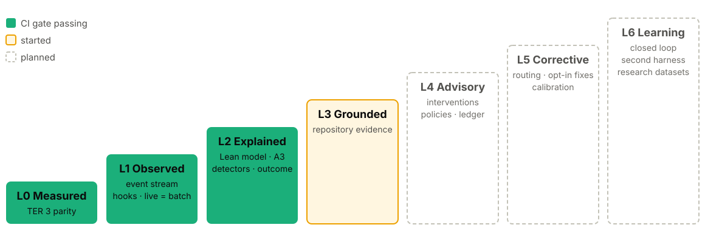

<!-- _class: lead -->
<!-- _paginate: false -->
<!-- _footer: "" -->

# TER

## Lean analysis for agentic software engineering

How efficiently did an agent turn a developer's intent into working software, where did it waste effort, and what should change so the next session wastes less?

`github.com/lgriffin/TER`

<!--
TER started as the Token Efficiency Ratio. TER 4 keeps that ratio and builds a Lean
analysis platform around it. This deck covers the intent, the Lean framing, the
engineering practices and where it is going. Everything shown as built exists on main;
anything planned is labelled planned.
-->

---

## The problem

Coding agents produce a lot of work. Most teams can only see the bill.

- A session is hundreds of reads, edits, shell calls and reasoning blocks.
- Token counts say **how much** was spent, not **what kind** of work it was.
- Nobody can say which part was value, which was necessary overhead, and which could have been avoided.
- Even when waste is visible, the fix is unclear: a prompt? a `CLAUDE.md` line? a hook? a setting?

> TER's aim: make the agent's process visible, name the waste with evidence, and turn it into concrete countermeasures.

<!--
The question is not "use fewer tokens". Fewer tokens are not automatically better and more
reasoning is not automatically waste. The question is whether the work moved the developer
toward the outcome they asked for.
-->

---

## Where TER came from: the Token Efficiency Ratio

**TER 3** scores model output only, never the user's prompts.

1. Load the transcript, merge sibling records, keep provenance.
2. Segment reasoning, tool use and responses into spans.
3. Build the intent from weighted prompt embeddings.
4. Classify each span as aligned or waste.
5. Compute TER per phase and as a weighted aggregate, `0 ≤ TER ≤ 1`.
6. Detect waste patterns and cost them with dated prices.

**The limit:** one ratio says how much was off-target. It cannot say *why*, or *what to change*. That is the gap TER 4 fills, without changing a single TER 3 score.

<!--
ter analyze still runs the TER 3 pipeline. TER 4 wraps it: golden snapshots freeze the
TER 3 scores, so the rebuild cannot drift them by accident.
-->

---

## Why Lean?

Lean asks of every activity one question:

> Does it add value the customer asked for, is it necessary but not itself valuable, or could it be avoided?

For TER:

- **The customer** is the developer.
- **Value** is the software outcome the developer requested.
- **Tokens are a cost**, not the goal.
- **Waste** has a type, a cause and a countermeasure, not just a size.

Lean gives a vocabulary that engineers and managers already share: value streams, flow, rework, waiting, the eight wastes and the A3.

<!--
Lean is the same thinking manufacturing and software teams use to find waste in a process,
applied to an agent's session. It turns "the agent was inefficient" into "the agent re-ran
the same check with nothing changed, here are the events, here is the hook that stops it".
-->

---

## The agentic value stream



Every event lands on one stage. A shell command is placed by what it does: `pytest` validates, `git status` explores, `pip install` implements.

<!--
Because stages come from tool kinds in the ter.event contract, the model carries over to
other harnesses. Developer prompts are the intent stage and are never scored.
-->

---

## Every event gets a class, and a reason

| Class | Meaning | Default for |
|---|---|---|
| **Value-adding** | Directly produces the requested outcome | edits and writes, the final response |
| **Necessary, non-value-adding** | Needed to produce value safely | exploring, planning, validating |
| **Avoidable** | Could have been skipped with no loss | the share claimed by a *confident* waste finding |
| **Uncertain** | A finding claims it below confidence 0.70 | shown, **never** counted as avoidable |

Every event carries a `basis`: the stage rule or the finding id that gave it its class. Any number in a report traces back to the events behind it.

<!--
The uncertain bucket matters. TER would rather miss a finding than make a false one:
anything below 0.70 confidence is shown so you can check it, but it never inflates the
waste numbers.
-->

---

## The eight wastes, as an agent commits them

| Lean waste | What it looks like for a coding agent |
|---|---|
| Rework | Changing work again because an attempt did not move a failing check |
| Motion | Re-reading files, re-running searches |
| Over-processing | Repeated calls, repeated reasoning, excessive planning, fragmented edits |
| Waiting | Blocked on another model, agent or external call |
| Inventory | Context acquired and carried but never used |
| Defects | Unvalidated or uninformed changes (risk findings) |
| Overproduction | Rewriting work that was already satisfactory |
| Handoffs | Delegating to a subagent, then doing the work anyway |

Each waste also moves time and tokens into a **flow state**, which gives flow efficiency.

---

## Waste detection: eleven detectors, all with evidence

- Detectors are plugins behind the `WasteDetector` protocol, registered in `DEFAULT_REGISTRY`.
- Each publishes its **confidence rule** in plain language.
- Each finding cites the **evidence events** it rests on and the events whose cost it claims.
- Thresholds are **structural**, never token counts: "the same check fails with the same signature after a fix", not "more than 500 tokens".

### Iteration is not rework

Fail, fix, a *different* failure, fix, pass: that is **productive iteration**, 100% flow efficiency, no findings. Only a failure that does not move after a fix is rework.

<!--
The detector catalogue: repeated_tool_call, repeated_exploration, rework_cycle,
unvalidated_implementation, premature_implementation, excessive_planning, fragmented_edits,
unused_context, unnecessary_handoff, repeated_reasoning, regeneration.
Each has unit tests with positive, negative and boundary cases.
-->

---

## What it looks like

```bash
ter explain tests/golden/sessions/lean_mix.jsonl
```

```text
TER explain · session golden-lean-mix
  flow efficiency  61% of generated tokens, 61% of agent time
  activity         value_adding 344 · necessary_non_value_adding 83 · avoidable 270 · uncertain 0
  findings         5 confident, 0 uncertain, 1 risk(s)
  - [0.80] overproduction: Rewrote src/retry.py in full · 138 tok · evidence 23e8557e97c5cf7b, bbef9c623af73c14
  - [0.80] over_processing: 5 planning steps without acting · 107 tok · evidence 11dd3be920e41229, …
  - [0.85] over_processing: Repeated validation run · 53 tok · evidence 3a6966ef0e054a01, …
  - [0.90] over_processing: Repeated Bash call · 26 tok · evidence dc771e57dc3ec0aa, …
  - [0.70] over_processing: 3 separate edits to src/net.py · 22 tok · evidence 201a5b895ab673e9, …
  - [0.85] defects: Responded after a failing check · risk · evidence c546d6039402b9c4, …
```

Confidence first, waste type, a plain-words title, its cost, and the event ids to check it.

---

## The A3: one page per run

<!-- _class: small -->



Lean's A3 walks a problem in order on one sheet. TER writes one per session.

1. **Background**
2. **Current state**: value stream map
3. **Analysis**: Pareto, activity, flow
4. **Root causes**, with evidence
5. **Countermeasures**
6. **Follow-up**: metric and target

Beside it, a **scorecard** of separate dimensions. No single opaque score.

<!--
ter a3 session.jsonl --html a3.html --json a3.json. The page is self-contained, no scripts
and no requests, works in light and dark, and prints on one A3 landscape sheet. Every number
on it is in the JSON. The screenshot is the real output for the synthetic lean_mix session.
-->

---

## Analysis and root causes



<!--
Left: the waste Pareto, the activity classes as a 100% bar, and flow by tokens and by time.
Right: every finding, largest cost first, with its Lean waste, confidence, cost and the
event ids it rests on. Risk findings such as "responded after a failing check" claim no
token cost.
-->

---

## Countermeasures you can apply today

<!-- _class: small -->



One block per detector that fired, most costly first. Four kinds of action:

- **Add to `CLAUDE.md`**: a standing instruction
- **Install a hook**: settings snippet and script
- **Harness setting**: e.g. plan mode
- **Practice**: for the developer

Lines are built from the session's own findings, such as the test command the agent actually ran.

---

## Plan, do, check, act

Each countermeasure is an **experiment**, not a rule.

1. **Plan**: read the A3, pick the costliest root cause.
2. **Do**: apply its countermeasure.
3. **Check**: run the next comparable session and compare the follow-up metric.
4. **Act**: keep it if the metric moved toward its target; remove it if not.

```bash
ter a3 before.jsonl --json before.json
ter a3 after.jsonl --json after.json
```

> A hook that fires often while flow does not improve is waste too. Remove it.

---

## Behaviour apart from outcome

Two questions, kept apart on purpose:

- **How did the agent behave?** Measured from the session's events: flow, activity, waste.
- **Is the resulting software correct?** A **verdict** from outcome evidence: `accepted`, `rejected` or `incomplete`.

```bash
ter a3 session.jsonl --outcome junit.xml --html a3.html
```

- The verdict reads test results (JUnit XML) through the `OutcomeSource` port.
- It is shown **beside** the Lean measures and never folded into them.
- No weighted outcome score: hand-set weights would hide which check decided the result.

<!--
Point 5 of the vision. A fast, tidy session that ships a broken change is not efficient,
and a messy session that lands a correct change is not a failure. Keeping the two apart
lets you see both.
-->

---

## Engineering: a hexagon, rebuilt by strangler fig



TER 4 wraps TER 3 and replaces it piece by piece. Every step ships and `ter analyze` keeps working.

<!--
ADR 0001: hexagonal strangler rebuild. The domain is pure: no TER 3 internals, no vendor
SDKs, no IO. Prices are data in a dated price book (ADR 0003), never hard-coded.
-->

---

## The rules are enforced, not described

| Rule | Enforced by |
|---|---|
| Dependencies point inward; the domain is pure | Seven `import-linter` contracts, `lint-imports` and `tests/architecture` |
| TER 3 scores never drift by accident | Golden snapshots; a scoring change is a committed snapshot diff |
| Every adapter honours its port | One contract suite per port, run against real adapters **and** fakes |
| Live analysis equals batch analysis | `tests/equivalence` on the golden corpus |
| New `ter` code is strictly typed | `mypy` overrides in `pyproject.toml` |
| Docs do not rot | `tests/docs`: links resolve, command examples name real options |
| Coverage does not slide | 90% branch coverage floor on Python 3.11 to 3.13 |

<!--
Leigh's rule of thumb: if it matters, a test or a CI step fails when it breaks.
ADR 0002 covers hermetic golden characterisation.
-->

---

## One event stream: transcripts and live hooks

- Transcripts and Claude Code hooks both become the same **`ter.event`** stream.
- Analysis is a **fold** over that stream: `AnalysisEngine.apply` is O(1) amortised and idempotent by event id, so **live = batch**.
- The capture hook maps `UserPromptSubmit`, `PreToolUse`, `PostToolUse`, `Stop` and `SubagentStop` into events, and **fails open**: it always answers `{}`.
- `--record DIR` keeps every raw payload, to calibrate the live path against real hooks.

```bash
python -m ter hook --record ~/ter-data/hooks < payload.json
python -m ter observe --event-log ~/.cache/ter/events
```

<!--
Failing open matters: a measurement tool must never break the developer's session.
Recordings hold tool inputs and outputs, so they stay outside the repository and are
redacted before sharing.
-->

---

## Maturity levels: L0 to L6



A level is claimed only when **every** requirement at that level is verified by a passing test. CI gates L0, L1 and L2 today. The level is also a runtime ceiling (planned, TER-INT-001).

<!--
Requirements verified, from the README: L0 23 of 24, L1 14 of 19, L2 33 of 55,
L3 2 of 20, L4 to L6 none yet. L2 is built and gated, with more detectors and a real
corpus to come.
-->

---

## Requirements control: EARS, traced to tests

- Every behaviour is an **EARS** requirement in `requirements/*.yaml`, written in one of six templates, such as *"When ‹trigger›, the ‹system› shall ‹response›."*
- Requirements start `planned` and become `verified` only when a passing test cites them: `@pytest.mark.req("TER-DET-002")`.
- Every requirement traces up to Leigh's **200-point vision**; every point has a **definition of done**.
- CI lints the grammar, then traces forward and backward and fails the gate on a gap.

```bash
ter-req lint --tests tests
ter-req trace --results req-trace.json --gate L2
ter-req points --check
```

**Today:** 50 points done, 49 partial, 101 not started.

<!--
Requirements and points move in the same PR as the code. A point is done only when its rules
are verified by tests. docs/ter4/points.md is generated, and CI fails when it is stale.
-->

---

## Real data, redacted first

Claims about real agent behaviour need real sessions. Synthetic tests are not enough.

- **The rule:** 46 points depend on real data and can **never** be marked done from synthetic tests alone (issues #34 to #46).
- **The corpus importer** redacts secrets, paths and file contents *before* anything is written, with a per-session redaction report and a manifest.
- Project names become stable pseudonyms; nothing raw is ever committed.

```bash
python -m ter corpus import ~/.claude/projects --out ~/ter-data/corpus
```

<!--
The tools to collect real data exist: corpus import and the hook recorder. The sessions
themselves are still to come. That is the honest state.
-->

---

## Open to other projects: capability packs

[ADR 0005](../docs/decisions/0005-admitting-external-capabilities.md): outside work enters TER as a **capability pack**, never as a second core.

| Part | Lives in |
|---|---|
| A **port**, with its obligations in the docstring | `ter.ports` |
| A **contract suite**, one test per obligation | `tests/contract/` |
| **EARS requirements**, linked to vision points | `requirements/*.yaml` |
| An **in-memory fake** that passes the suite | `ter.adapters` |
| One **reference adapter**, registered by entry point | `ter.capabilities` |

Coupling is by **file contract, not import**: adapters read another system's files by published schema name, so TER installs and tests without it.

---

## GARE integration

**GARE** records agent usage and governance data that overlaps TER's levels L1, L4 and L5. It is the first external project brought in through capability packs.

| Capability | Status |
|---|---|
| Outcome and acceptance verdict, `OutcomeSource` port with JUnit reference adapter | **Built** |
| Import rule: `gare`, `pydantic`, `httpx` forbidden in the domain and core | **Built**, enforced in CI |
| GARE outcome adapter reading GARE's recorded runs (#52) | Planned: needs GARE schema and a recorded run |
| GARE as a second session source, proving the event contract is harness-neutral | Planned (L6) |
| Tokens per verified outcome; repair-loop detector over GARE attempts | Planned |

<!--
GARE's concepts are re-specified as EARS requirements, not vendored. New goals GARE brings
become points past P200 with a recorded origin; P001 to P200 stay Leigh's verbatim text.
-->

---

## Where it is going

| Level | Adds | Status |
|---|---|---|
| **L3 Grounded** | Repository evidence: symbols, tests, git diff, change surface | Started: evidence-graph edges |
| **L4 Advisory** | Intervention engine, declarative policies, an intervention ledger | Planned |
| **L5 Corrective** | Routing, opt-in corrective actions, calibration | Planned |
| **L6 Learning** | Closed loop, a second harness, research datasets | Planned |

Near term: real sessions in the corpus, calibrating detectors and the live hook path against them, more detectors, and the GARE packs.

<!--
Each later level is a step from describing waste to preventing it: explain after the fact
(L2), ground in the repository (L3), advise during the session (L4), correct with consent
(L5), and learn from the ledger of what worked (L6).
-->

---

<!-- _class: lead -->

## Signals, not verdicts

TER is a heuristic, decision-support tool. Its numbers are signals to investigate, not verdicts on a developer, a model or a session.

```bash
python -m pip install -e ".[dev]"
ter a3 tests/golden/sessions/lean_mix.jsonl --html a3.html
```

Guides: Lean · A3 · hooks · testing · EARS · architecture, all in `docs/guides`.

<!--
Try it on the synthetic sessions first; they are built to show particular wastes.
Then point it at your own sessions in ~/.claude/projects.
-->
